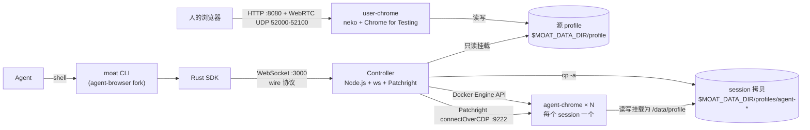
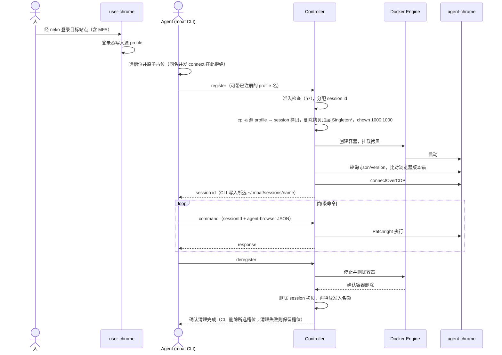
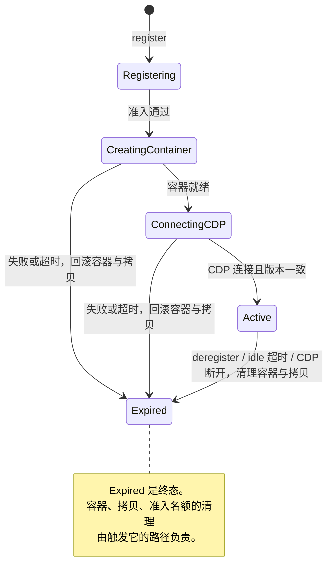

# moat-browser

让多个 AI agent 各自拥有一个浏览器，并带着人的登录态工作。

它只解决两件事：

1. **agent 抢浏览器**：多个 agent（以及人自己）不再挤在同一个浏览器实例里。
2. **user-data 共享**：人登录一次，agent 拿到这份登录态，而不需要碰人的本机浏览器或凭据。

远程桌面用 [neko](https://github.com/m1k1o/neko)，agent 命令行用 [agent-browser](https://github.com/vercel-labs/agent-browser)。两者都是现成、合适的载体，不是本项目的核心（见 §3）。

---

## 1. 问题

### 1.1 agent 抢浏览器

本地浏览器自动化工具（agent-browser、Playwright MCP 等）默认把 agent 接到本机的一个浏览器上。多个 agent 并行，或 agent 与人同时使用时：

- 同一个 Chrome 实例里，tab、焦点、导航、JavaScript 弹窗、按住的键鼠都是共享状态。一个 agent 的操作会改掉另一个 agent 正在看的页面。
- 一个 user-data-dir 同一时刻只能由一个 Chrome 进程打开（`SingletonLock`）。第二个 agent 想带同样的登录态，只能挤进同一个实例。
- 人日常用的浏览器被 agent 占着，人和 agent 互相打断。

### 1.2 登录态怎么交给 agent

agent 要操作的网站大多需要登录，而密码、MFA、验证码应当由人完成。人已经在本机 Chrome 登录过，但没有稳定的办法把本机登录态交给 agent：

| 路径 | 为什么不行 |
|------|-----------|
| 以 `--remote-debugging-port` 重启本机 Chrome | 要关掉人正在用的浏览器；安全软件会拦截；agent 仍然和人共用一个实例（§1.1） |
| 扩展导出 cookie | 行为与凭据窃取器无异，商店审核不过；Manifest V3 继续收紧 |
| 直接解密 cookie 数据库 | 依赖 Windows DPAPI / macOS Keychain 与浏览器版本；安全软件会拦截 |
| 复制本机 profile 目录 | 不同 Chrome 版本的 profile 格式不兼容，跨版本打开可能崩溃；cookie 加密绑定本机密钥 |

**结论**：人在一个由 moat 管理、版本固定的浏览器里登录一次，agent 的登录态默认就来自这份 profile。

---

## 2. 做法

**一份由人维护的源 profile，每个 agent session 一份拷贝，每个 session 一个独立浏览器。**

- 源 profile 只有一个写入者：人，通过 user-chrome 容器写入。Controller 只读挂载它。（运维还可以登记额外的命名 profile 作为来源，见 §6；拷贝与隔离规则相同。）
- agent 执行 `moat connect` 时，Controller 把源 profile `cp -a` 到这个 session 专属的目录，再启动一个只属于这个 session 的 agent-chrome 容器。
- 各个 agent 不共享浏览器进程、tab 或 profile 目录。它们共享的只是 connect 时拷贝到的登录态。这次拷贝不是原子快照（§11.7）。
- 拷贝不会写回。session 里刷新的 cookie、新的登录、localStorage 改动都会在 session 结束时随拷贝一起删除（删除失败的情况见 §11.10）。登录态需要更新时，由人回到 user-chrome 重新登录。

各对象的权威源头与生命周期：

| 对象 | 创建与维护者 | 开始 | 结束 |
|------|-------------|------|------|
| 源 profile（宿主 `$MOAT_DATA_DIR/profile`） | 人，经 user-chrome | 首次登录 | 不随 session 变化；人重新登录时更新 |
| session | Controller（`register` 分配随机 UUID） | `moat connect` | `moat disconnect`、idle 超时或 CDP 断开（§5） |
| session profile 拷贝（`$MOAT_DATA_DIR/profiles/agent-<base64url(owner)>-<session>`） | Controller | session 创建时 `cp -a` | 容器删除后 `rm -rf`（§11.10） |
| agent-chrome 容器 | Controller，经 Docker Engine API | 拷贝完成后 | session 结束 |
| `$HOME/.moat/sessions/<name>` | CLI 本地保存的所选 session id，只是索引；`--session` > `AGENT_BROWSER_SESSION` > `default` | connect 前原子占位，注册成功后写入 id | Controller 确认清理完成后删除该槽位 |

profile 拷贝和容器都嵌套在 Controller session 之内：先有 session 再建拷贝和容器；结束 session 时先删容器，再删拷贝，Controller 确认后 CLI 才删除所选本地槽位。不同名字的槽位互不影响。

---

## 3. 两个现成载体

核心是 §2 的生命周期：源 profile → session 拷贝 → 独立浏览器，由 Controller 持有。人的入口和 agent 的入口各选了一个现成项目，只用它们擅长的部分。

### 3.1 neko：人的入口

需要解决的是：人从任意设备远程操作一个长期运行、profile 落在服务器磁盘上的浏览器，完成登录。neko 在一个镜像里提供了完整的 WebRTC 远程桌面（Xorg、GStreamer、pion WebRTC、X11 输入注入、浏览器内播放器）。

- 用到的：固定版本的 neko base 镜像（`ghcr.io/m1k1o/neko/base:3.1.5`），换装与 agent 侧同版本的 Chrome for Testing（§11.1、§11.4）。
- 没用的：neko 官方的浏览器镜像（Debian Chromium）。user-chrome 也不开放 CDP，它只供人交互。
- 可替换性：任何能运行这个固定版本的 Chrome、并把 profile 写到宿主挂载点的远程桌面方案都能替代它。

### 3.2 agent-browser：agent 的入口

需要解决的是：给 agent 一套已经在实战中验证过的浏览器命令词汇。agent-browser 提供了语义定位器（`find role/label/text/...`，对应 Playwright 的 `getBy*`）、`snapshot` + `@eN` 引用、`--json` 输出和 `batch`。

- 用到的：`moat` CLI（`cli/moat-cli`）是 agent-browser 的 fork，保留它的命令词汇、定位器和响应 JSON 形状。会用 agent-browser 的 agent 可以直接用 moat。
- 替换掉的：upstream 的本地 daemon 加本地 Chrome，换成 Rust SDK（`cli/sdk`）→ WebSocket → Controller → 这个 session 的 agent-chrome。upstream 的本地 launcher、plugin、dashboard 等能力统一返回 `unsupported_in_moat`。
- 同步方式与改动清单：`cli/UPSTREAM.md`、`cli/moat-cli/src/fork_features/trunk-patches.md`。
- 可替换性：wire 协议是 agent-browser daemon JSON 加一层 session envelope（§10），任何能说这套协议的客户端都可以接入 Controller。

---

## 4. 架构



| 组件 | 运行方式 | 内容 |
|------|---------|------|
| user-chrome（`images/user-chrome`） | 常驻，唯一 | neko base + Chrome for Testing；profile 在 `/home/neko/.config/chromium`（宿主挂载）；不开 remote debugging |
| Controller（`packages/controller`） | 常驻，唯一服务端进程 | Node.js + `ws` + Patchright + arktype；通过 Unix socket 调 Docker Engine API（不用 dockerode） |
| agent-chrome（`images/agent-chrome`） | 每个 session 一个，按需创建和销毁 | `debian:bookworm-slim` + Xorg dummy + openbox + Chrome for Testing；Chrome 只监听 `127.0.0.1:9223`，socat 转发到 `0.0.0.0:9222`；内存上限 384MiB，`/dev/shm` 2GiB |
| moat CLI + Rust SDK（`cli/`） | agent 所在机器 | 二进制 `moat`；每个发往 Controller 的请求新开一个 WebSocket |
| wire 类型（`packages/types`） | 库 | wire 协议与 Controller ADT 的 TypeScript 定义和 arktype schema |

两侧浏览器都使用 `--password-store=basic`，都以 uid 1000 运行，版本相同（§11.4），所以拷贝过去的 cookie 可以在 agent 侧直接解密使用。这一点由 §11.4 的 profile 护栏端到端验证，配置一致本身并不能证明。

Controller 用 Patchright（Playwright 的反检测 fork）驱动 agent-chrome。它在这里承担三件事：

- **执行命令**：`packages/controller/src/cdp-bridge.ts` 用 `chromium.connectOverCDP` 接入 agent-chrome。agent 的每条命令（`open`、`find role ... click`、`snapshot` 等）都由 Controller 翻译成 Patchright 的 Playwright API 调用来执行。
- **驱动时不暴露 CDP 痕迹**：普通 Playwright 接入后会对每个页面发送 `Runtime.enable`，页面脚本可以借此察觉调试器，这是常见的自动化检测点。Patchright 不发 `Runtime.enable`，改在隔离的执行上下文里运行脚本，也不启用 Console 域。这些补丁在驱动层，对 `connectOverCDP` 同样生效。
- **版本锚**：两侧 Chrome for Testing 的版本都从 Patchright 派生（§11.4）。

agent-chrome 的 Chrome 不由 Patchright 启动，而由 supervisord 启动（`images/agent-chrome/supervisord.conf`），Controller 只负责接入。这样做是为了在保留上述反检测能力的同时让扩展可用：启动参数完全由镜像决定，带 `--disable-blink-features=AutomationControlled`，不带 `--enable-automation`、`--disable-popup-blocking`、`--disable-component-update`、`--disable-default-apps`、`--disable-extensions`。Patchright 调整启动默认参数的那部分补丁因此用不上，它的效果已经由这组参数直接给出。

扩展只有一个来源：人在 user-chrome 里安装（user-chrome 同样不禁用扩展，也没有限制扩展的策略），扩展随源 profile 整份拷贝进每个 session。agent 侧不能自行加载扩展，`moat --extension` 返回 `unsupported_in_moat`。profile 护栏（§11.4）不检查扩展，拷贝后的扩展能否在 agent 侧正常启用没有自动化验证。

---

## 5. Session 生命周期





| 事件 | 结果 |
|------|------|
| `moat disconnect`（`destroy`、`close-session`、`close` 为同一路径） | 关闭 CDP 连接，停止并删除容器，删除拷贝，释放准入名额。只有 Controller 确认清理完成，CLI 才删除所选 `$HOME/.moat/sessions/<name>`；任一步失败或结果未知时返回非零，保留该槽位以便重试。 |
| 无命令时间超过 `SESSION_IDLE_TIMEOUT`（默认 10 分钟，每 30 秒扫描一次） | Controller 自行清理容器、拷贝和准入名额；清理失败保留尚未确认清理的资源。CLI 本地所选槽位不会随之删除，要等 agent 执行一次得到确认的 `moat disconnect`。 |
| agent-chrome 的 CDP 断开 | 同上一行，但跳过关闭 CDP 连接。 |
| WebSocket 断开 | 不影响 session。CLI 本来就为每个发往 Controller 的请求新开一个连接，后续请求凭 session id 继续。 |
| Controller 重启 | 开始监听前先回收本 Controller owner 的 agent-chrome 容器及其拷贝，扫描本 owner 与旧格式的孤儿目录；Docker/磁盘清理或准入 reconcile 失败则不接受新连接。 |

---

## 6. Profile 来源

agent 只能按名称选择 profile，不能传路径，只能在 `moat init` / `moat connect` 时选择，不从环境变量或配置文件继承：

- `default`（省略时即为 `default`）→ `PROFILE_SOURCE`，生产环境中就是人维护的源 profile，以只读方式挂载给 Controller。
- 其他名称 → 运维在 `PROFILE_REGISTRY` 中登记的 `名称 → 绝对路径` JSON。路径必须位于 `PROFILE_STORE`（默认等于 `PROFILES_WORK`）之内，符号链接逃逸也会被拒绝；`default` 不能被重新映射。
- 未登记、路径形状或越界的名称在创建 session 前返回 `errorType: "invalid_value"`。Controller 不会推断 `/data/<name>`，也不会自动创建 profile。`PROFILE_REGISTRY` 格式错误时，Controller 启动即以 78 退出。

```bash
PROFILE_STORE=/data/profiles
PROFILE_REGISTRY='{"named-fixture":"/data/profiles/named-fixture"}'
moat connect --profile named-fixture
```

---

## 7. 并发、隔离与准入

- **隔离单位是 session**：独立的容器、独立的 profile 拷贝、独立的 tab、弹窗和键鼠状态。一个 session 里的操作不会改变另一个 session 的浏览器状态。隔离只到浏览器为止：多个 session 用同一账号登录同一个网站时，在网站上做的修改（发消息、改设置、下单）对所有 session 和人都可见，网站也可能因为同一账号多处同时登录而让旧会话失效。
- **准入**：
  - `SESSION_TOTAL_QUOTA`：全局上限，取值 1–5，默认 5。
  - `SESSION_QUOTA`：本 Controller owner 的上限，默认等于全局上限。
  - `SESSION_OWNER_QUOTAS`：多个 owner 共享全局上限时的分配，如 `owner-a=3,owner-b=2`。
  - 满额时返回 `errorType: "capacity_exceeded"`，附带当前计数和重试条件（等现有 session 及其清理资源完全释放）。不排队。
- **Controller owner**：取 `CONTROLLER_OWNER`，否则取 Controller 容器的 Compose project 标签。它限定容器标签、启动回收和配额的范围，不代表客户端身份。
- **客户端**：`--session <name>` 优先于 `AGENT_BROWSER_SESSION`，两者未指定时选择 `default`；每个名字使用独立的 `$HOME/.moat/sessions/<name>` 句柄。名字须为 1–255 个 ASCII 字母、数字、`_` 或 `-`，无效名字在网络请求前拒绝。同一名字的 `connect` 在本地原子占位，第二个请求在注册前被拒绝；不同名字的 agent 可共享一个 `HOME` 而不共用浏览器。旧 `$HOME/.moat/session` 不再读取，已有远端 session 由 Controller idle 超时回收。

每个 session 对应一个 agent-chrome 容器，内存硬上限 384MiB。

---

## 8. 使用

### 8.1 人：登录

1. 用浏览器打开 `http://<host>:8080`（neko；口令是部署时设置的 `NEKO_USER_PASSWORD` / `NEKO_ADMIN_PASSWORD`，见 §9）。
2. 在远程 Chrome 里登录目标站点，包括 MFA。
3. 完成登录后再让 agent connect。已经在运行的 session 看不到之后的登录，需要重新 connect。

### 8.2 agent：执行

```bash
# 从源码构建 CLI，并放进 PATH
cd cli && cargo build --release && cd ..
sudo install -m 0755 cli/target/release/moat /usr/local/bin/moat

export MOAT_CONTROLLER="ws://<host>:3000"

moat --session agent-a connect                 # 同一 HOME 下按名字隔离；未指定则使用 default
moat --session agent-a open https://example.com/dashboard
moat --session agent-a find role button --name "Sign in" click
moat --session agent-a snapshot
moat --session agent-a disconnect
```

Controller 地址的优先级：本次 `--controller` > `MOAT_CONTROLLER` > `~/.moat/config.json` 的 `controller` 字段。前两者一旦设置就必须是非空 URL，设为空值会直接报错，不会回落到下一级。

session 槽位选择优先级为本次 `--session <name>` > `AGENT_BROWSER_SESSION` > `default`，仅改变本地 session 句柄的选择，不改变 Controller 的 profile 选择或 wire 协议。`status` 只读所选本地槽位与本次解析出的 Controller URL，不探测远端健康。

与 agent-browser 的主要差异：不会自动启动本地浏览器，操作远程浏览器的命令需要先 `init`/`connect`，否则以 exit 77 退出（`--help`、`--version` 以及本地的 `state list/show/clear/clean/rename` 不需要 session；`status` 只看本地，没有 session 时同样返回 77）；`get cdp-url` 固定返回 `unsupported_in_moat`，因为 CDP 只在 Controller 的 Docker 网络内可达。

面向 agent 的完整 CLI 契约随仓库分发在 `skills/moat/SKILL.md`，包括命令、`errorType`/`cause`、退出码、弹窗、网络、state 与 cookie、设备模拟和超时预算。

---

## 9. 自行部署

**只推荐在 x86_64（amd64）Linux 主机上部署，不推荐 macOS。**两个浏览器镜像只有 `linux/amd64`（Chrome for Testing 的 Linux 包只有 x64），项目没有适配 Apple Silicon。在 Apple Silicon 上经 Docker Desktop / OrbStack 转译运行已知有问题：宿主 `chown 1000:1000` 的目录在容器内显示为 root 所有，浏览器无法写入 profile；agent-chrome 在 384MiB 内存上限下会 OOM。

仓库根目录的 `compose.yaml` 从源码在本地构建全部三个 moat-browser 镜像，不需要任何预构建的 moat-browser 镜像（构建时仍会拉取公开的基础镜像和 Chrome for Testing 包）：

```bash
export MOAT_DATA_DIR=/srv/moat-browser               # 绝对路径，见下文
export NEKO_WEBRTC_NAT1TO1=<浏览器访问本机所用的地址>
export NEKO_USER_PASSWORD=... NEKO_ADMIN_PASSWORD=...
mkdir -p "$MOAT_DATA_DIR/profile" "$MOAT_DATA_DIR/profiles"
sudo chown -R 1000:1000 "$MOAT_DATA_DIR"              # §11.3
docker compose up -d --build
```

| 服务 | 端口 | 挂载 |
|------|------|------|
| `user-chrome` | `8080`；UDP `52000-52100`（WebRTC，1:1 映射，不能改映射） | `$MOAT_DATA_DIR/profile` → `/home/neko/.config/chromium` |
| `controller` | `3000` | `$MOAT_DATA_DIR/profile` → `/data/profile:ro`；`$MOAT_DATA_DIR/profiles` → `/data/profiles`；`/var/run/docker.sock` |
| `agent-chrome-image` | 无 | 无；负责构建 Controller 为每个 session 创建容器所用的镜像，并让它一直被引用，避免 `docker image prune` 后 connect 失败 |

- `MOAT_DATA_DIR` 必须是绝对路径：Controller 通过 Docker socket 创建 agent-chrome 容器时，按宿主路径（`PROFILES_HOST_PATH`）挂载 session 拷贝。
- Controller 与 user-chrome 必须在同一台 Docker 主机上，共用 `moat` 网络。
- 本仓库不包含 CI。维护者的镜像发布与生产部署在单独的私有仓库中维护。

Controller 环境变量：

| 变量 | 默认值 | 含义 |
|------|--------|------|
| `PORT` | `3000` | WebSocket 端口 |
| `PROFILE_SOURCE` | `/data/profile` | `default` profile 的来源 |
| `PROFILES_WORK` | `/data/profiles` | session 拷贝所在目录（Controller 视角） |
| `PROFILES_HOST_PATH` | `PROFILES_WORK` | 同一目录在宿主上的路径，用于给 agent-chrome 做 bind mount |
| `PROFILE_STORE` | `PROFILES_WORK` | 命名 profile 必须位于其内 |
| `PROFILE_REGISTRY` | `{}` | 命名 profile 的 `名称 → 绝对路径` JSON |
| `DOCKER_NETWORK` | `moat` | agent-chrome 加入的网络 |
| `AGENT_CHROME_IMAGE` | `agent-chrome:latest` | agent-chrome 镜像（`compose.yaml` 设为 `moat-browser/agent-chrome:local`） |
| `CONTROLLER_OWNER` | Compose project 标签 | 资源 owner；无法解析时启动以 78 退出 |
| `SESSION_TOTAL_QUOTA` / `SESSION_QUOTA` / `SESSION_OWNER_QUOTAS` | `5` / 同总额 / 无 | 准入（§7）；配置非法时启动以 78 退出 |
| `SESSION_IDLE_TIMEOUT` | `600000` ms | idle 回收 |
| `CDP_READY_TIMEOUT` | `30000` ms | 等待 agent-chrome CDP 就绪 |
| `COMMAND_TIMEOUT` | `25000` ms | 普通命令的服务端预算 |
| `ADMISSION_STATE_PATH` | `${PROFILES_WORK}/.moat-admission` | 准入状态文件 |

---

## 10. Wire 协议

CLI 与 Controller 之间的命令体沿用 agent-browser daemon 的命令 JSON 形状（由 SDK 规范化后发送，例如去掉 daemon 的请求 `id`），外面包一层 session envelope。请求按 `type` 区分，只有三种：`register`、`deregister`、`command`。正常响应是 `register_result`、`deregister_result`、`command_result`；消息无法解析或处理时 Controller 返回 `type: "error"`，这个分支目前不在 TypeScript 的 `WireResponse` 类型里。

```json
{
  "type": "command",
  "sessionId": "abc123",
  "command": {
    "action": "getbyrole",
    "role": "button",
    "subaction": "click",
    "name": "Submit",
    "exact": false
  }
}
```

- 预算：普通命令默认 25s（服务端 `COMMAND_TIMEOUT`），`register` 45s；wait 类命令可以用 `--timeout` 指定 1–120000ms。客户端 deadline 在服务端预算之外再留 5s 网络余量。服务端预算耗尽返回 `errorType: "timeout"`；客户端 deadline 到期由 SDK 本地报超时。两种情况下结果都可能已经部分生效。
- Rust SDK 对单个编码后的请求和响应执行 8 MiB 上限检查。网络请求列表按页返回；网络正文和 HAR 通过续取句柄分块传输。
- TypeScript 定义在 `packages/types`，Controller 用其中的 arktype schema 解析请求。Rust 侧定义在 `cli/sdk/src/wire.rs`：命令体是 `serde_json::Value`，由 SDK 规范化后序列化；响应用 serde 结构解析。两端各自维护，没有生成器或跨语言一致性测试（§11.9）。
- Controller 的内部模块与 ADT：`docs/controller-design.md`；Rust SDK：`docs/rust-sdk-design.md`。

---

## 11. 已知约束与决策记录

### 11.1 Debian Chromium 的 CDP session 缺陷

Debian 打包的 Chromium（neko 官方浏览器镜像使用的就是它）在 CDP `Target.setAutoAttach` 上有缺陷：session 创建后立即失效，Playwright、Patchright、Puppeteer 都能复现。同版本号的 Chrome for Testing 没有这个问题。因此 agent-chrome 使用 Chrome for Testing。user-chrome 虽然不需要 CDP，但两侧必须同版本 profile 才能整份拷贝，所以也使用同一版本锚派生的 Chrome for Testing。

### 11.2 容器内 Chrome 必须 `--no-sandbox`

Docker 容器内的 zygote 沙箱需要额外特权；不加 `--no-sandbox` 会报 `Operation not permitted`。

### 11.3 Profile 目录属主 uid 1000

两侧浏览器都以 uid 1000 运行（user-chrome 的 `neko`，agent-chrome 的 `chrome`）。session 拷贝要 `chown -R 1000:1000`，否则会 `Permission denied`。

### 11.4 Patchright 版本锚与 profile 护栏

Patchright 与 Chrome 版本强绑定。仓库里的 Chrome 版本只有一个来源：`packages/controller/package.json` 中精确锁定的 `patchright`（及 `bun.lock`）所依赖的 `patchright-core`，取其 `browsers.json` 中 chromium 的 `browserVersion`。

- 构建：两个浏览器镜像在构建时都用 `images/chrome-anchor.mjs` 派生版本，并下载对应的 Chrome for Testing 到 `/opt/chrome`。没有版本构建参数；推导或下载失败，构建就失败。两个镜像都以仓库根目录为 context：`docker build --platform linux/amd64 -f images/<user-chrome|agent-chrome>/Dockerfile .`。
- 部署前：`scripts/verify-chrome-versions.sh <controller 镜像> <user 镜像> <agent 镜像>` 比对三个镜像内的实际版本，不一致即失败；发布流水线在部署前运行它，自行构建时也可以用它检查本地镜像。
- 运行时：Controller 启动时读取自身安装的 `patchright-core` 的版本。每次创建 session 都把 agent-chrome 的 `/json/version` 与之比对，不符或无法解析就拒绝该 session（`BrowserVersionMismatch`）。
- 升级：只修改 `patchright` 的精确 pin 并更新 `bun.lock`，重新构建镜像。

版本号一致并不能证明拷贝后的登录态仍然有效：浏览器升级可能迁移 profile 格式或改变 cookie 加密。推进版本锚的改动合入前、以及每次发布前，都要对候选的三个镜像运行护栏。这是人工步骤，发布流水线不会自动运行它：

```bash
MOAT=cli/target/release/moat bun run packages/e2e/profile-guard.ts \
  --controller-image <controller 镜像> --user-image <user 镜像> --agent-image <agent 镜像>
```

护栏的流程：用 user 镜像的浏览器在临时容器里登录本地 fixture，产出源 profile；再由候选 Controller 真实拷贝并启动 agent。它检查关键条目与哨兵文件在拷贝后是否保留、候选 Controller 的拷贝与同浏览器 `cp -a` 对照组的差异、SIGTRAP、`basic` password store，以及登录凭据在 agent 侧是否直接有效（含空 profile 负对照）；它不对整份 profile 逐文件校验。末行为 `PASS profile-guard …`（exit 0）才算通过；任何阶段失败都会输出一行 `FAIL [stage] 原因` 并以非 0 退出。在 Apple Silicon 上经 OrbStack 转译运行 amd64 Chrome 时，384MiB 内存上限会触发 OOM，可以加 `--emulation-memory-1g`（只放宽护栏自建的容器）；原生 amd64 主机上不需要。

### 11.5 Bun 需要 host CPU

Bun 在 qemu64 CPU 上会 hang，VM 必须使用 `cpu: host`。

### 11.6 Controller 必须运行在 Node.js 上

此前多次实测，Patchright 在 Bun 运行时下连接 CDP 有兼容性问题。Controller 是唯一使用 Patchright `connectOverCDP` 的组件，所以使用 Node.js；types 与 e2e 不使用 Patchright，继续使用 Bun（`packages/e2e/profile-guard.ts` 直接用 WebSocket 发原始 CDP 命令，不受此问题影响）。

### 11.7 拷贝不与运行中的 user-chrome 协调

user-chrome 的 Chrome 常驻运行，Controller 拷贝时不会暂停它，也不做 SQLite checkpoint，只删除拷贝顶层属于运行中进程的 `Singleton*` 锁。如果人正在操作、浏览器正在写 profile，拷贝可能落在写入中间。人完成登录后再 connect 可以降低这种风险，但没有机制保证一致性。


### 11.8 session id 就是访问凭证

Controller 不认证客户端，也不把 session 绑定到发起的连接：能访问 `:3000` 并持有 session id 的一方就能操作或销毁该 session。访问边界完全依赖网络（LAN / NetBird）。

### 11.9 wire 协议两端定义没有机械校验

TypeScript（`packages/types`）与 Rust（`cli/sdk/src/wire.rs`）各自维护定义，没有生成器、共享 fixture 或跨语言一致性测试。改协议时两边都要改，并用 E2E 验证。

### 11.10 session 拷贝清理与跨 owner 边界

删除顺序以 Docker 为准：停止/删除失败时保留可能仍在挂载的整份 profile；Docker 确认已删除后再删除副本，`rm` 失败返回 `command_failed`/`cleanup` 并保留准入占位与 CLI 句柄以待重试。Controller 启动时回收本 owner 的遗留容器，扫描本 owner 的当前格式与 `agent-<uuid>` 旧格式目录；用所有 owner 的 Docker mount 检查保护存活副本，清理未挂载的候选。启动检查失败则拒绝监听。CDP 下载使用当前 owner 的副本内目录，不再生成单独的旧格式目录。

其他 owner 的当前格式目录即使暂时没有 Docker mount，也可能正在复制、尚未创建容器；本 Controller 不依据一次 mount 快照跨 owner 删除。生产宿主的 `D−L` / `L−D` 须在发布后逐项核对，若含其他 owner 孤儿，应交其 owner 确认生命周期并清理。副本含登录 cookie，不能以“无容器”替代确认。详细生命周期见 `docs/controller-design.md`。

---

## 12. 仓库结构与相关文档

| 路径 | 内容 |
|------|------|
| `cli/moat-cli/` | `moat` CLI，agent-browser 的 fork |
| `cli/sdk/` | Rust SDK（`moat-sdk`）：WebSocket transport、session 文件、wire 编解码 |
| `cli/UPSTREAM.md` | 与 upstream agent-browser 的差异和同步记录 |
| `packages/types/` | wire 协议与 ADT 的 TypeScript 定义 + arktype schema |
| `packages/controller/` | Controller |
| `packages/e2e/` | E2E 测试、profile 护栏、测试用 Compose |
| `images/user-chrome/`、`images/agent-chrome/`、`images/chrome-anchor.mjs` | 两个浏览器镜像与版本锚 |
| `compose.yaml` | 从源码本地构建并运行全部服务（§9） |
| `scripts/` | 镜像版本校验、CLI 命令覆盖清单、CLI 安装脚本（从维护者的私有 release 下载，需要访问权限） |
| `skills/moat/SKILL.md` | 面向 agent 的 CLI 使用说明，随仓库分发 |
| `docs/container-design.md` | 两个镜像的设计 |
| `docs/controller-design.md` | Controller 模块设计 |
| `docs/rust-sdk-design.md` | Rust SDK 设计 |
| `docs/e2e-test-plan.md` | CLI E2E 测试方案 |
| `docs/spike-139-*.md` | 2026-04 CLI↔Controller 往返 spike 的历史报告 |
