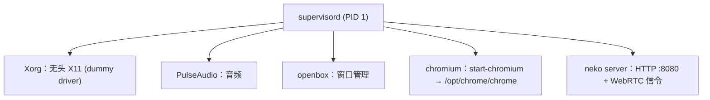

# 容器设计：user-chrome & agent-chrome

本文档是 `images/user-chrome/` 和 `images/agent-chrome/` 两个 Docker 镜像的设计规格。覆盖基础镜像选择、进程编排、端口暴露、Profile 持久化、容器间协作，以及最终的 docker-compose 编排。

---

## 1. user-chrome

### 1.1 定位

人类通过 neko WebRTC 远程桌面登录 SaaS 系统。常驻运行，是 Profile 的源头。

### 1.2 基础镜像

`ghcr.io/m1k1o/neko/base`，以版本 tag + digest 固定（见 `images/user-chrome/Dockerfile`），不用 `latest`。base 自带远程桌面功能栈，浏览器由本仓库装入：

| 组件 | 来源 |
|------|------|
| Xorg + xserver-xorg-video-dummy | neko base：无头 X11 显示 |
| GStreamer (ximagesrc + VP8/H264) | neko base：屏幕捕获 + 视频编码（CPU） |
| pion WebRTC (Go) | neko base：P2P 低延迟流传输 |
| X11 C 绑定 (libXtst) | neko base：鼠标/键盘输入注入 |
| PulseAudio | neko base：音频（登录场景可选） |
| supervisord | neko base：进程编排，加载 `/etc/neko/supervisord/*.conf` |
| neko server (Go 单二进制) + Vue.js 客户端 | neko base：HTTP + WebSocket + WebRTC 信令，浏览器内播放器 |
| openbox | Debian 包（base 不带，与上游 neko 浏览器变体一样自行安装） |
| Chrome for Testing | chrome-for-testing-public，装到 `/opt/chrome`，版本由 Patchright 锚派生 |
| fonts-liberation、ca-certificates | Debian 包（CfT 在 base 之外的依赖） |

### 1.3 为什么用 neko base + Chrome for Testing

人类登录本身不依赖 CDP，但 agent 要整份打开 user 写出的 profile，两侧浏览器必须同版本；同时 user 侧浏览器版本要由仓库控制，而不是跟随上游浮动的 `neko/chromium:latest`。因此 user-chrome 与 agent-chrome 用同一个锚派生 CfT（README §11.4），构建阶段与 agent-chrome 相同（§2.5），同样以仓库根目录为 context：

```bash
docker build --platform linux/amd64 -f images/user-chrome/Dockerfile .
```

### 1.4 浏览器配置

唯一实现是 `images/user-chrome/`（`Dockerfile`、`chromium.conf`、`start-chromium.sh`、`openbox.xml`、`policies.json`），本文只说明设计要点：

| 要点 | 原因 |
|------|------|
| `--user-data-dir=/home/neko/.config/chromium`，不加 `--bwsi` | profile 落在宿主挂载点；访客模式不会把登录态写入 profile |
| `--password-store=basic` | 与 agent-chrome 相同的 cookie 加密方式，拷贝后可直接解密 |
| 不启用 remote debugging | user-chrome 只做人类交互，不对任何调用方开放 CDP |
| `start-chromium.sh` 在 exec 浏览器前删除 profile 顶层 `SingletonLock`/`SingletonSocket`/`SingletonCookie` | 容器被替换后 profile 仍在但主机名变了，上一个容器的锁会让浏览器拒绝启动；同一时刻只有一个 user-chrome 容器、容器内只有一个浏览器进程，此刻的锁必然过期 |
| 镜像内预建 `/home/neko/.config/chromium` 并归 `neko` 所有 | 新建的 named volume 继承该属主，浏览器才能创建 profile |
| `policies.json` 放在 `/etc/opt/chrome_for_testing/policies/managed/` | CfT 只读取自己品牌的策略目录；放在 Chromium 目录会静默失效 |

`policies.json`:

```json
{
  "DefaultCookiesSetting": 1,
  "RestoreOnStartup": 1,
  "BlockThirdPartyCookies": false
}
```

这让浏览器在容器重启后保留登录状态（前提是 profile 目录通过卷挂载持久化）。

### 1.5 进程编排

neko base 的 supervisord 管理显示栈与 neko server；`images/user-chrome/chromium.conf` 挂到 `/etc/neko/supervisord/chromium.conf`，增加 `openbox` 与 `chromium` 两个 program（浏览器日志 `/var/log/neko/chromium.log`）：



neko base 的 healthcheck 只请求 neko server 的 `/health`，不反映浏览器进程状态；浏览器是否正常要看 `supervisorctl status chromium` 与 `chromium.log`。

### 1.6 端口

| 端口 | 协议 | 用途 |
|------|------|------|
| 8080 | TCP | neko Web UI + WebSocket 信令 |
| 52000-52100 | UDP | WebRTC 媒体流（ICE candidates） |

**WebRTC 端口约束**：UDP 端口必须 1:1 映射（不能 remap），这是 WebRTC ICE 的固有限制。

### 1.7 卷挂载

| 容器路径 | 宿主路径 | 用途 |
|---------|---------|------|
| `/home/neko/.config/chromium` | `/data/profile` | 浏览器 profile 持久化（Cookie、localStorage、Session） |

容器内以 `neko` 用户 (UID 1000) 运行浏览器。宿主目录必须：

```bash
chown -R 1000:1000 /data/profile
```

### 1.8 环境变量

| 变量 | 值 | 说明 |
|------|-----|------|
| `NEKO_DESKTOP_SCREEN` | `1920x1080@30` | 分辨率 + 帧率 |
| `NEKO_MEMBER_MULTIUSER_USER_PASSWORD` | `<user-pw>` | 普通用户密码 |
| `NEKO_MEMBER_MULTIUSER_ADMIN_PASSWORD` | `<admin-pw>` | 管理员密码（可控制键鼠） |
| `NEKO_WEBRTC_EPR` | `52000-52100` | WebRTC 端口范围 |
| `NEKO_WEBRTC_ICELITE` | `1` | 轻量 ICE agent（同 LAN 无需 STUN/TURN） |
| `NEKO_WEBRTC_NAT1TO1` | WebRTC 客户端可达的宿主地址（生产取值见 `stacks/moat-browser/compose.yaml`） | 写入 ICE candidate 的地址 |

### 1.9 关键约束

| 约束 | 原因 |
|------|------|
| `shm_size: 2gb` | 浏览器使用 /dev/shm 做进程间通信，Docker 默认 64MB 会导致崩溃 |
| `cap_add: SYS_ADMIN` | 浏览器 sandbox 需要（`chromium.conf` 已带 `--no-sandbox`，但 SYS_ADMIN 仍推荐） |

---

## 2. agent-chrome

### 2.1 定位

纯浏览器环境，供 Controller 通过 Patchright `connectOverCDP` 操控。按需创建/销毁，每个 Agent session 一个实例。

### 2.2 为什么不用 neko 镜像

两个原因：

1. **CDP session bug**：Debian 打包的 Chromium 的 `Target.setAutoAttach` 创建的 session 立即失效，Playwright/Patchright/Puppeteer 的 `connectOverCDP` 完全不工作。必须使用 Chrome for Testing（同版本号无此问题）。

2. **不需要 neko 功能栈**：agent-chrome 不需要 WebRTC、GStreamer、输入注入、Vue.js 客户端。这些组件只会浪费内存和增加攻击面。

### 2.3 基础镜像

```
debian:bookworm-slim
```

从干净 Debian base 组装，只装必要组件。

### 2.4 组件清单

| 组件 | 来源 | 说明 |
|------|------|------|
| Xorg + xserver-xorg-video-dummy | Debian 包，xorg.conf 参考 neko | 无头 X11 显示（Chrome for Testing 需要） |
| openbox | Debian 包 | 轻量窗口管理 |
| Chrome for Testing | Google CfT 存储（chrome-for-testing-public） | 替代 Debian Chromium，CDP 实现正确；版本由 Patchright 锚派生（§2.5） |
| supervisord | Debian 包 | 进程编排 |
| fonts-liberation + fonts-noto-cjk | Debian 包 | 西文 + 中日韩字体 |

**不需要**：neko server、GStreamer、WebRTC、PulseAudio、libXtst 输入注入、dbus。

### 2.5 Chrome for Testing 安装

版本不在任何地方手写，而是在镜像构建内从 Patchright 派生（README §11.4）：

1. `chrome-anchor` 阶段运行 `images/chrome-anchor.mjs`：读取 `packages/controller/package.json` 中 `patchright` 的精确版本 → 该版本对 `patchright-core` 的精确依赖 → `patchright-core` 包内 `browsers.json` 的 chromium `browserVersion`。任一环节不是精确版本，或读取失败，构建即失败。
2. `chrome-for-testing` 阶段按该版本下载 `chrome-for-testing-public/<version>/linux64/chrome-linux64.zip`，解压到 `/opt/chrome`；下载失败构建即失败，不回退到其他版本。
3. 最终镜像只拷贝 `/opt/chrome`，并链接 `/usr/local/bin/chrome`。

镜像没有版本构建参数；升级 Chrome 的唯一方式是改 Patchright 的 pin 并更新 `bun.lock`。构建必须以仓库根目录为 context：

```bash
docker build --platform linux/amd64 -f images/agent-chrome/Dockerfile .
```

### 2.6 非 root 用户

与 neko 保持一致，使用 UID 1000：

```dockerfile
RUN groupadd -g 1000 chrome \
    && useradd -m -u 1000 -g chrome chrome
```

Profile 目录由 Controller 在创建容器时从 user-chrome 拷贝并 `chown -R 1000:1000`。

### 2.7 Xorg 配置

参考 neko 的 xorg.conf，最小化配置：

`xorg.conf`:

```
Section "Device"
    Identifier  "dummy"
    Driver      "dummy"
    VideoRam    256000
EndSection

Section "Screen"
    Identifier  "screen"
    Device      "dummy"
    Monitor     "monitor"
    DefaultDepth 24
    SubSection "Display"
        Depth   24
        Modes   "1920x1080"
    EndSubSection
EndSection

Section "Monitor"
    Identifier  "monitor"
    HorizSync   1-100
    VertRefresh 1-100
EndSection
```

### 2.8 Chrome 启动参数与 supervisord

唯一实现是 `images/agent-chrome/supervisord.conf`，本文不再保存副本，只说明设计要点：

| 要点 | 原因 |
|------|------|
| `--no-sandbox` | Docker 容器内 zygote 沙箱需要特权（见 README §11.2） |
| `--disable-gpu`、`--disable-dev-shm-usage` | 容器内无 GPU；避开 64MB `/dev/shm` 限制 |
| `--user-data-dir=/data/profile` | 从 user-chrome 拷贝来的整份 profile |
| `--password-store=basic` | 与 user-chrome 相同的 cookie 加密方式，不依赖容器里是否恰好没有 keyring；副本中的 cookie 可直接解密 |
| `--disable-blink-features=AutomationControlled`、`--disable-infobars` | 隐藏自动化痕迹（Patchright 额外加固） |
| Chrome 监听 `127.0.0.1:9223`，socat（`cdp-proxy`）把 `0.0.0.0:9222` 转发过去 | Chrome 111+ 无视 `--remote-debugging-address=0.0.0.0`，只在 loopback 监听（CVE-2023-2459 的 DNS rebinding 缓解）；Controller 需要从 `moat` 网络访问 `<container-ip>:9222` |

启动顺序：Xorg (100) → openbox (200) → Chrome (300) → cdp-proxy (350)。

### 2.9 端口

| 端口 | 协议 | 用途 |
|------|------|------|
| 9222 | TCP | Chrome DevTools Protocol（仅 Controller 内部使用） |

agent-chrome 的 9222 端口不对宿主暴露。Controller 通过 Docker 内部网络直接访问容器 IP:9222；`moat` CLI 不提供该私有地址，`moat get cdp-url` 以 `unsupported_in_moat` 明确拒绝。

### 2.10 卷挂载

| 容器路径 | 宿主路径 | 用途 |
|---------|---------|------|
| `/data/profile` | `/data/profiles/agent-<session-id>` | 从 user-chrome 拷贝来的 profile |

由 Controller 在创建容器前准备：

```bash
cp -a /data/profile /data/profiles/agent-<session-id>
rm -f /data/profiles/agent-<session-id>/Singleton*
chown -R 1000:1000 /data/profiles/agent-<session-id>
```

### 2.11 CDP 就绪检测

Controller 创建容器后，需要轮询 CDP 端口直到就绪：

```
GET http://<container-ip>:9222/json/version
```

返回 200 + JSON 表示 Chrome 已启动。Controller 随即解析其中的 `Browser` 字段（如 `Chrome/<version>`），与自身安装的 `patchright-core` 的 `browsers.json` 版本比对（controller 启动时读取，读取失败即以 78 退出）。版本不符或无法解析时，本次 session 以 `BrowserVersionMismatch` 失败（错误文本带期望版本与实际观测值），容器、profile 副本和配额按注册失败路径回收。版本相符才调用：

```typescript
patchright.chromium.connectOverCDP(`http://<container-ip>:9222`)
```

### 2.12 Dockerfile

唯一实现是 `images/agent-chrome/Dockerfile`（配合 `images/chrome-anchor.mjs`、`images/agent-chrome/xorg.conf`、`images/agent-chrome/supervisord.conf`），本文不再保存副本。组件与构建阶段见 §2.4、§2.5。

---

## 3. 容器间协作

### 3.1 Profile 流转

```
user-chrome                       Controller                    agent-chrome
/home/neko/.config/chromium/   →  cp -a → /data/profiles/       → /data/profile/
(宿主: /data/profile)             agent-<id>/                    (容器挂载)
```

详细流程：

1. 人类通过 neko 登录 SaaS → Cookie/Session 写入 user-chrome 的 `/home/neko/.config/chromium/`
2. user-chrome 挂载 `/data/profile` 到宿主，宿主持有完整 profile
3. Agent 请求 `connect` → Controller 执行：
   ```bash
   cp -a /data/profile /data/profiles/agent-<session-id>
   chown -R 1000:1000 /data/profiles/agent-<session-id>
   ```
4. Controller 通过 Docker Engine API 创建 agent-chrome 容器，挂载拷贝
5. Agent 请求 `disconnect` → Controller 停止并删除容器 + `rm -rf /data/profiles/agent-<session-id>`

### 3.2 Profile 路径映射

| 容器 | 容器内路径 | 宿主路径 |
|------|-----------|---------|
| user-chrome | `/home/neko/.config/chromium` | `/data/profile` |
| agent-chrome #1 | `/data/profile` | `/data/profiles/agent-abc123` |
| agent-chrome #2 | `/data/profile` | `/data/profiles/agent-def456` |

user-chrome 容器内浏览器以 neko 用户运行，`--user-data-dir=/home/neko/.config/chromium`。通过卷挂载，这个路径映射到宿主的 `/data/profile`。

agent-chrome 使用 `--user-data-dir=/data/profile`，容器内路径统一。每个实例挂载各自的宿主目录（拷贝份）。

### 3.3 网络模型

所有容器在同一个 Docker bridge 网络中：

```
                  docker network: moat
                         │
        ┌────────────────┼────────────────┐
        │                │                │
  user-chrome      agent-chrome #1   agent-chrome #2
  172.18.0.2       172.18.0.3        172.18.0.4
  :8080 (neko)     :9222 (CDP)       :9222 (CDP)
```

- Controller 运行在宿主（或另一个容器），通过 Docker 网络访问 agent-chrome 的 CDP 端口
- agent-chrome 的 9222 端口**不对宿主暴露**，只在 Docker 网络内可达
- user-chrome 的 8080 端口**对宿主暴露**（用户浏览器需要直接访问）
- user-chrome 的 52000-52100 UDP 端口**对宿主暴露**（WebRTC 媒体流）

### 3.4 Controller 容器管理 API 调用

Controller 通过 Docker Engine API（fetch + Unix socket）管理 agent-chrome：

**创建容器**：
```
POST /containers/create
{
  "Image": "agent-chrome:latest",
  "ExposedPorts": { "9222/tcp": {} },
  "HostConfig": {
    "Binds": ["/data/profiles/agent-<id>:/data/profile"],
    "NetworkMode": "moat",
    "ShmSize": 2147483648,
    "Memory": 402653184,
    "MemorySwap": 402653184
  }
}
```

**启动容器**：
```
POST /containers/<id>/start
```

**获取容器 IP**：
```
GET /containers/<id>/json
→ .NetworkSettings.Networks.moat.IPAddress
```

每个 agent-chrome 的 cgroup 内存上限固定为 384 MiB，且 `MemorySwap` 与 `Memory` 相同，避免浏览器 session 在共享宿主上无限增长。该限制与共享准入总额 N=5 配套，不把稳态均值当作任意负载的安全证明。

**停止 + 删除**：
```
POST /containers/<id>/stop
DELETE /containers/<id>
```

### 3.5 docker-compose（开发/E2E 环境）

唯一实现是 `packages/e2e/docker-compose.test.yml`，本文不再保存副本。设计要点：

- user-chrome、controller 常驻，三个镜像都以仓库根目录为 context 构建；controller 挂载 Docker socket 来管理 agent-chrome，`profile-data` 卷同时挂载到 user-chrome（读写）和 controller（只读，作为 `cp -a` 源），`profiles-work` 是 profile 拷贝的工作目录。
- `NEKO_WEBRTC_NAT1TO1` 由运行环境提供（WebRTC 客户端能到达的本机地址），未设置时 compose 直接报错，不写死任何测试机地址。
- compose 中的 `agent-chrome-image` 是镜像持有者（与生产 stack 相同的模式）：按 `images/agent-chrome/Dockerfile`（仓库根 context）构建镜像，以 `sleep infinity` 常驻，使该镜像不被清理，供 controller 的 `AGENT_CHROME_IMAGE` 使用；controller 依赖它启动。它不是 session 容器，也不暴露 CDP；每个 session 的 agent-chrome 容器仍由 controller 通过 Docker Engine API 动态创建和销毁。
- 所有容器在 `moat` bridge 网络中，controller 通过容器 IP 访问 9222。

### 3.6 生命周期总览

```
                    常驻                              按需
              ┌─────────────┐                  ┌─────────────┐
              │ user-chrome │                  │ agent-chrome │
              │             │                  │   ×N 个实例   │
              │ 人类登录 SaaS │                  │              │
              │ profile 写入 │                  │ profile 拷贝  │
              │             │                  │ CDP :9222    │
              └──────┬──────┘                  └──────┬──────┘
                     │                                │
                     │   /data/profile (源)            │  /data/profiles/agent-<id> (拷贝)
                     │                                │
              ┌──────▼────────────────────────────────▼──────┐
              │                 Controller                    │
              │                                              │
              │  1. cp -a profile → profiles/agent-<id>      │
              │  2. docker create agent-chrome (挂载拷贝)     │
              │  3. 轮询 CDP :9222/json/version              │
              │  4. Patchright connectOverCDP                 │
              │  5. 执行命令 → 返回结果                        │
              │  6. disconnect → stop + rm 容器 + rm profile  │
              └──────────────────────────────────────────────┘
```

---

## 4. 已知约束汇总

| 约束 | 影响范围 | 说明 |
|------|---------|------|
| Debian Chromium CDP bug | agent-chrome | 必须用 Chrome for Testing（README §11.1） |
| `--no-sandbox` | 两者 | 容器内 zygote 沙箱不可用（README §11.2） |
| UID 1000 | 两者 | profile 目录 `chown -R 1000:1000`（README §11.3） |
| Patchright 版本锚 | 两者 | 两个浏览器镜像的 CfT 都在构建内从 Patchright 锚派生；部署前三方校验，controller 拒绝版本不符的 agent 浏览器（README §11.4） |
| shm_size | 两者 | Chromium 需要 ≥ 2GB /dev/shm（或 `--disable-dev-shm-usage`） |
| WebRTC 端口 1:1 映射 | user-chrome | UDP 端口不能 remap |
