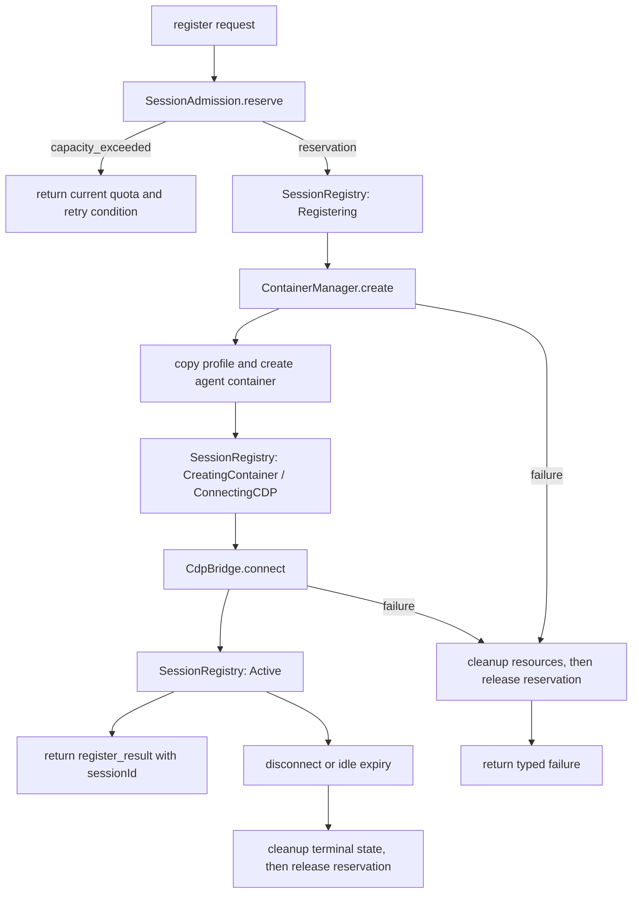

# Controller 设计

Controller 是 moat-browser 的唯一服务端进程。接收 SDK 的 wire 协议请求，通过 Patchright CDP 在 agent-chrome 上执行浏览器命令，管理 session 和容器生命周期。

---

## 1. 设计原则：全链路 ADT，零 any

**禁止所有不具名类型**。从 WebSocket 入口到 Patchright 执行再到响应返回，每一个数据结构都必须是具名的、可穷举的 discriminated union 或 product type。

具体约束：

| 禁止 | 替代 | 理由 |
|------|------|------|
| `any` | 具名 ADT 变体 | 破坏类型追踪，编译器无法检查穷举 |
| `unknown` | 具名 union（如 `EvalResult`） | 同上，且下游消费者被迫 type assertion |
| `as` 类型断言 | 类型收窄（switch/if + _tag） | 断言绕过编译器，运行时可能不一致 |
| `Record<string, any>` | 具名 type 的字段 | 丢失结构信息 |
| `...` 省略字段 | 显式列出每个字段 | wire 协议是契约，省略即歧义 |
| `object` 作为类型 | 具名 type | 无结构信息 |

**全链路含义**：

```
WebSocket JSON 进入
  → arktype schema 验证（运行时保证结构）
  → WireRequest ADT（编译时类型）
  → BrowserCommand ADT（exhaustive switch 路由）
  → Patchright API 调用
  → CommandResultData ADT（每个 action 对应一个具名 result variant）
  → WireResponse ADT
  → JSON 序列化发出
```

链路中任何一环出现 `any` / `unknown` / untyped object，都意味着类型追踪断裂——上游的变更不会在下游产生编译错误，bug 只能在运行时发现。

**唯一例外**：Patchright/Playwright 库的返回类型如果是 `any`（如 `page.evaluate` 的返回值），在 Controller 边界处**立即收窄**为具名类型，不允许 `any` 向外传播。

---

## 2. 定位

```
SDK (TS / Rust)  ──WebSocket──►  Controller  ──CDP──►  agent-chrome
                                     │
                                     ├── Session Registry（session 状态机）
                                     ├── Container Manager（Docker Engine API）
                                     └── CDP Bridge（Patchright connectOverCDP）
```

**唯一服务端**：不拆 Gateway、daemon、注册服务。所有逻辑（WebSocket 服务端、session 管理、容器管理、CDP 桥接）集中在一个 Node.js 进程。

---

## 3. 技术栈

| 技术 | 用途 | 选型理由 |
|------|------|---------|
| Node.js + TypeScript | 运行时 | Patchright 与 Bun 有 CDP 兼容性问题（README §11.6） |
| ws (原生 WebSocket) | 对外 API | 不用 socket.io，wire 协议是简单的 JSON request/response |
| patchright | connectOverCDP → agent-chrome | 反检测 Playwright fork，API 与 Playwright 完全兼容 |
| arktype | 运行时消息验证 | wire 协议 JSON schema 的运行时检查 |
| Docker Engine API | 管理 agent-chrome 容器 | fetch + Unix socket，不用 dockerode |

---

## 4. 模块架构

```
packages/controller/
├── src/
│   ├── index.ts              # 入口：启动 WebSocket Server
│   ├── ws-server.ts          # WebSocket 服务端：协议解码、路由、编码
│   ├── session-registry.ts   # Session 状态机 + session → 容器映射
│   ├── container-manager.ts  # Docker Engine API 封装
│   ├── cdp-bridge.ts         # Patchright connectOverCDP + 命令执行
│   ├── ref-store.ts          # @eN 引用存储（每 session 独立）
│   └── types.ts              # 内部 ADT（re-export from @moat-browser/types）
├── package.json
└── tsconfig.json
```

四个核心模块的职责边界：

| 模块 | 输入 | 输出 | 状态 |
|------|------|------|------|
| **ws-server** | WebSocket 消息 (JSON) | WebSocket 消息 (JSON) | 无（纯路由） |
| **session-registry** | register / resume / deregister 请求 | session 状态变更 | SessionState Map |
| **container-manager** | create / destroy / inspect 请求 | 容器 ID、IP | 无（Docker 是状态源） |
| **cdp-bridge** | BrowserCommand + CDP URL | BrowserResponse | Patchright Browser/Page 实例 |
| **ref-store** | snapshot 结果 | @eN → Playwright Locator 映射 | RefMap per session |

---

## 5. Wire 协议

### 5.1 传输

- WebSocket，JSON 文本帧
- 端口 3000（可配置）
- 无认证（Phase 1，内网环境）

### 5.2 请求格式

所有请求共享 session envelope + command body：

```typescript
type WireRequest =
  | { readonly type: "register"; readonly profile?: string }
  | { readonly type: "resume"; readonly sessionId: string }
  | { readonly type: "deregister"; readonly sessionId: string }
  | { readonly type: "command"; readonly sessionId: string; readonly command: BrowserCommand };
```

### 5.3 BrowserCommand

对齐 agent-browser daemon JSON 格式。`action` 字段做 discriminant：

```typescript
type BrowserCommand =
  // 导航
  | { readonly action: "navigate"; readonly url: string }
  | { readonly action: "back" }
  | { readonly action: "forward" }
  | { readonly action: "reload" }
  | { readonly action: "wait"; readonly time?: number }

  // 语义定位器 + 动作
  | {
      readonly action: "getbyrole";
      readonly role: string;
      readonly name?: string;
      readonly exact?: boolean;
      readonly subaction?: "click" | "fill" | "type" | "check" | "uncheck" | "hover";
      readonly value?: string;
      readonly nth?: number;
    }
  | {
      readonly action: "getbylabel";
      readonly label: string;
      readonly exact?: boolean;
      readonly subaction?: "click" | "fill" | "type" | "check" | "uncheck" | "hover";
      readonly value?: string;
    }
  | {
      readonly action: "getbyplaceholder";
      readonly placeholder: string;
      readonly exact?: boolean;
      readonly subaction?: "click" | "fill" | "type";
      readonly value?: string;
    }
  | {
      readonly action: "getbytext";
      readonly text: string;
      readonly exact?: boolean;
      readonly subaction?: "click" | "hover";
    }
  | {
      readonly action: "getbyalttext";
      readonly text: string;
      readonly exact?: boolean;
      readonly subaction?: "click" | "hover";
    }
  | {
      readonly action: "getbytitle";
      readonly text: string;
      readonly exact?: boolean;
      readonly subaction?: "click" | "hover";
    }
  | {
      readonly action: "getbytestid";
      readonly testId: string;
      readonly subaction?: "click" | "fill" | "type";
      readonly value?: string;
    }

  // @eN 引用操作
  | { readonly action: "click"; readonly ref: string }
  | { readonly action: "fill"; readonly ref: string; readonly value: string }
  | { readonly action: "type"; readonly ref: string; readonly value: string }
  | { readonly action: "hover"; readonly ref: string }

  // 页面信息
  | { readonly action: "snapshot" }
  | { readonly action: "screenshot"; readonly format?: "png" | "jpeg"; readonly quality?: number }
  | { readonly action: "eval"; readonly code: string }

  // 键盘
  | { readonly action: "press"; readonly key: string }

  // 滚动
  | { readonly action: "scroll"; readonly direction: "up" | "down" | "left" | "right"; readonly amount?: number }

  // Tab 管理
  | { readonly action: "tab_new"; readonly url?: string }
  | { readonly action: "tab_switch"; readonly index: number }
  | { readonly action: "tab_close"; readonly index?: number }
  | { readonly action: "tab_list" }

  // Cookie
  | { readonly action: "cookies_get"; readonly url?: string }
  | { readonly action: "cookies_clear" };
```

### 5.4 响应格式

```typescript
type WireResponse =
  | {
      readonly type: "register_result";
      readonly success: true;
      readonly sessionId: string;
    }
  | {
      readonly type: "register_result";
      readonly success: false;
      readonly error: string;
      readonly code: number;
    }
  | {
      readonly type: "command_result";
      readonly sessionId: string;
      readonly success: true;
      readonly data: CommandResultData;
      readonly boundary?: ContentBoundary;
    }
  | {
      readonly type: "command_result";
      readonly sessionId: string;
      readonly success: false;
      readonly error: string;
      readonly code: number;
    }
  | {
      readonly type: "deregister_result";
      readonly sessionId: string;
      readonly success: boolean;
    };
```

### 5.5 CommandResultData

**每个 action 对应一个具名 result variant，禁止 `unknown` 和省略字段（见 §1 设计原则）。**

```typescript
/** 导航结果 */
type NavigateResult = {
  readonly _tag: "NavigateResult";
  readonly url: string;
  readonly title: string;
};

/** 无返回值的动作（click / fill / type / hover / check / uncheck / press / scroll / wait / cookies_clear） */
type VoidResult = {
  readonly _tag: "VoidResult";
};

/** 纯定位（语义定位器无 subaction） */
type LocatorResult = {
  readonly _tag: "LocatorResult";
  readonly found: true;
  readonly count: number;
};

/** ARIA 快照 */
type SnapshotResult = {
  readonly _tag: "SnapshotResult";
  readonly aria: string;  // 带 [ref=eN] 标记的 ARIA 树文本
};

/** 截图 */
type ScreenshotResult = {
  readonly _tag: "ScreenshotResult";
  readonly base64: string;
  readonly format: "png" | "jpeg";
};

/**
 * eval 结果。
 * page.evaluate() 返回 Playwright 的 Serializable（本质是 any）。
 * Controller 在 CDP Bridge 边界处立即 JSON.stringify，收窄为 string。
 * 消费者 JSON.parse 后自行处理。这是 any 被截断的唯一位置。
 */
type EvalResult = {
  readonly _tag: "EvalResult";
  readonly json: string;  // JSON.stringify(page.evaluate(...))
};

/** Tab 信息 */
type TabInfo = {
  readonly index: number;
  readonly url: string;
  readonly title: string;
  readonly active: boolean;
};

/** Tab 列表结果（tab_list / tab_new / tab_switch / tab_close 共用） */
type TabResult = {
  readonly _tag: "TabResult";
  readonly tabs: ReadonlyArray<TabInfo>;
};

/** Cookie 条目 — 显式列出每个字段，不省略 */
type CookieEntry = {
  readonly name: string;
  readonly value: string;
  readonly domain: string;
  readonly path: string;
  readonly expires: number;
  readonly httpOnly: boolean;
  readonly secure: boolean;
  readonly sameSite: "Strict" | "Lax" | "None";
};

/** Cookie 查询结果 */
type CookiesResult = {
  readonly _tag: "CookiesResult";
  readonly cookies: ReadonlyArray<CookieEntry>;
};

/** discriminated union — exhaustive switch on _tag */
type CommandResultData =
  | NavigateResult
  | VoidResult
  | LocatorResult
  | SnapshotResult
  | ScreenshotResult
  | EvalResult
  | TabResult
  | CookiesResult;
```

action → result variant 映射：

| action | result variant |
|--------|---------------|
| navigate / back / forward / reload | `NavigateResult` |
| getbyrole / getbylabel / getbyplaceholder / getbytext / getbyalttext / getbytitle / getbytestid（有 subaction） | `VoidResult` |
| getbyrole / getbylabel / getbyplaceholder / getbytext / getbyalttext / getbytitle / getbytestid（无 subaction） | `LocatorResult` |
| click / fill / type / hover（@ref） | `VoidResult` |
| press / scroll / wait / cookies_clear | `VoidResult` |
| snapshot | `SnapshotResult` |
| screenshot | `ScreenshotResult` |
| eval | `EvalResult` |
| tab_list / tab_new / tab_switch / tab_close | `TabResult` |
| cookies_get | `CookiesResult` |

### 5.6 ContentBoundary

防 prompt injection，对齐 agent-browser 的 content boundary nonce：

```typescript
type ContentBoundary = {
  readonly nonce: string;   // 16 字节 hex（CSPRNG）
  readonly origin: string;  // 页面 origin
};
```

仅在 snapshot / eval / screenshot 等包含页面内容的响应中附带。SDK 在输出时用 nonce 包裹页面内容，防止恶意页面伪造命令输出。

### 5.7 错误码

对齐 agent-browser exit code + moat 新增：

| code | 含义 | 场景 |
|------|------|------|
| 0 | 成功 | — |
| 1 | 通用错误 | 命令执行失败 |
| 2 | 用法错误 | 无效命令格式（arktype 验证失败） |
| 66 | 元素未找到 | 语义定位器或 @ref 无匹配 |
| 69 | Controller 不可达 | SDK 连不上 Controller（SDK 侧使用） |
| 75 | 超时 | Patchright 操作超时 |
| 77 | 无 session | 未 register 就发 command |
| 78 | 配置错误 | 缺少必要配置 |
| 80 | 容器创建失败 | Docker API 返回错误 |
| 81 | CDP 不可达 | agent-chrome 的 CDP 端口无响应 |
| 82 | Profile 拷贝失败 | cp -a 失败 |
| 83 | Session 已过期 | session 因 idle/断连已销毁 |

---

## 6. Session Registry

### 6.1 状态机

```
                    register
                       │
                       ▼
                 ┌───────────┐
                 │Registering│
                 └─────┬─────┘
                       │ profile cp -a 成功
                       ▼
              ┌──────────────────┐
              │CreatingContainer │
              └────────┬─────────┘
                       │ docker create + start 成功
                       ▼
              ┌──────────────────┐
              │ ConnectingCDP    │
              └────────┬─────────┘
                       │ /json/version 返回 200
                       │ + Patchright connectOverCDP 成功
                       ▼
                 ┌───────────┐
                 │  Active   │◄──────── resume（WebSocket 重连）
                 └─────┬─────┘
                       │
          ┌────────────┼────────────────┐
          │            │                │
     idle 超时    CDP 断连       WebSocket 断连
          │            │                │
          ▼            ▼                ▼
     ┌─────────┐ ┌─────────┐    ┌──────────────┐
     │ Expired │ │ Expired │    │ Reconnecting │
     └─────────┘ └─────────┘    └──────┬───────┘
                                       │
                                  5s 内无 resume
                                       │
                                       ▼
                                 ┌─────────┐
                                 │ Expired │
                                 └─────────┘
```

### 6.2 SessionState ADT

```typescript
type SessionState =
  | { readonly _tag: "Registering" }
  | { readonly _tag: "CreatingContainer"; readonly profilePath: string }
  | { readonly _tag: "ConnectingCDP"; readonly containerId: string }
  | {
      readonly _tag: "Active";
      readonly containerId: string;
      readonly containerIp: string;
      readonly cdpUrl: string;
      readonly browser: Browser;         // Patchright Browser 实例
      readonly context: BrowserContext;   // 默认 context
      readonly createdAt: number;
      readonly lastActivity: number;
    }
  | { readonly _tag: "Reconnecting"; readonly since: number; readonly containerId: string }
  | { readonly _tag: "Expired"; readonly reason: string };
```

### 6.3 Session Registry 接口

```typescript
interface SessionRegistry {
  register(profile?: string): Promise<Result<string, ControllerError>>;
  resume(sessionId: string): Promise<Result<void, ControllerError>>;
  deregister(sessionId: string): Promise<Result<void, ControllerError>>;
  get(sessionId: string): SessionState | undefined;
  getActive(sessionId: string): Result<ActiveSession, ControllerError>;
}
```

`getActive` 是命令执行的前置检查——从 registry 取 session，断言状态为 Active，否则返回对应错误（SessionNotFound / SessionExpired / SessionNotReady）。

### 6.4 idle 超时

Active session 维护 `lastActivity` 时间戳。每次命令执行更新。定时器每 30s 扫描，超过阈值（默认 10 分钟）的 session 转入 Expired，触发容器清理。

### 6.5 WebSocket 断连处理

1. WebSocket `close` 事件触发
2. session 转入 Reconnecting，记录 `since` 时间戳
3. 5 秒内 SDK 可通过新 WebSocket 连接发送 `resume` 请求
4. resume 成功：session 回到 Active（容器和 CDP 连接不动）
5. resume 超时：session 转入 Expired，触发容器清理

---

## 7. Container Manager

### 7.1 职责

通过 Docker Engine API（fetch + Unix socket `/var/run/docker.sock`）管理 agent-chrome 容器。

### 7.2 接口

```typescript
interface ContainerManager {
  create(sessionId: string, profilePath: string): Promise<Result<ContainerInfo, ControllerError>>;
  destroy(sessionId: string): Promise<Result<void, ControllerError>>;
  inspect(containerId: string): Promise<Result<ContainerInfo, ControllerError>>;
}

type ContainerInfo = {
  readonly containerId: string;
  readonly ip: string;
  readonly cdpPort: number;  // 固定 9222
};
```

### 7.3 创建流程

```
create(sessionId, profilePath):
  1. cp -a <PROFILE_SOURCE> → <PROFILES_WORK>/agent-<sessionId>
  2. chown -R 1000:1000 <PROFILES_WORK>/agent-<sessionId>
  3. POST /containers/create
     {
       Image: "agent-chrome:latest",
       HostConfig: {
         Binds: ["<PROFILES_WORK>/agent-<sessionId>:/data/profile"],
         NetworkMode: "moat",
         ShmSize: 2147483648
       }
     }
  4. POST /containers/<id>/start
  5. GET /containers/<id>/json → 提取 IP
  6. 轮询 http://<ip>:9222/json/version（最多 30s，间隔 500ms）
  7. 返回 { containerId, ip, cdpPort: 9222 }
```

步骤 1-2 通过 `child_process.execFile` 执行（cp -a 和 chown 是文件系统操作）。步骤 3-6 通过 fetch + Unix socket。

### 7.4 销毁流程

```
destroy(sessionId):
  1. POST /containers/<id>/stop?t=5   （5s graceful shutdown）
  2. DELETE /containers/<id>
  3. rm -rf <PROFILES_WORK>/agent-<sessionId>
```

### 7.5 Docker Engine API 调用封装

所有 Docker API 调用通过统一的 fetch 封装：

```typescript
async function dockerFetch(path: string, init?: RequestInit): Promise<Response> {
  return fetch(`http://localhost${path}`, {
    ...init,
    // @ts-expect-error — Node.js fetch 支持 Unix socket
    unix: "/var/run/docker.sock",
  });
}
```

---

## 8. CDP Bridge

### 8.1 职责

持有 Patchright Browser/BrowserContext/Page 实例，将 BrowserCommand 翻译为 Playwright API 调用。**每个 return 都必须构造具名 ADT variant（见 §1），不允许返回匿名对象字面量。**

### 8.2 连接

```typescript
import { chromium } from "patchright";

type CdpConnection = {
  readonly browser: Browser;
  readonly context: BrowserContext;
};

async function connectCDP(cdpUrl: string): Promise<CdpConnection> {
  const browser = await chromium.connectOverCDP(cdpUrl);
  const context = browser.contexts()[0];  // agent-chrome 只有一个 context
  return { browser, context };
}
```

`connectOverCDP` 连接到已运行的 Chrome for Testing 实例。返回的 Browser 对象可获取已有的 BrowserContext 和 Page。

### 8.3 命令执行

核心是一个 exhaustive switch on `command.action`。**每个 case 返回具名 CommandResultData variant，不返回匿名 `{}`。**

```typescript
async function executeCommand(
  context: BrowserContext,
  command: BrowserCommand,
  refStore: RefStore,
): Promise<Result<CommandResultData, ControllerError>> {

  const page = context.pages()[activeTabIndex] ?? context.pages()[0];

  switch (command.action) {
    case "navigate": {
      await page.goto(command.url, { waitUntil: "domcontentloaded" });
      const result: NavigateResult = { _tag: "NavigateResult", url: page.url(), title: await page.title() };
      return ok(result);
    }

    case "back": {
      await page.goBack({ waitUntil: "domcontentloaded" });
      const result: NavigateResult = { _tag: "NavigateResult", url: page.url(), title: await page.title() };
      return ok(result);
    }

    case "forward": {
      await page.goForward({ waitUntil: "domcontentloaded" });
      const result: NavigateResult = { _tag: "NavigateResult", url: page.url(), title: await page.title() };
      return ok(result);
    }

    case "reload": {
      await page.reload({ waitUntil: "domcontentloaded" });
      const result: NavigateResult = { _tag: "NavigateResult", url: page.url(), title: await page.title() };
      return ok(result);
    }

    case "getbyrole":
      return executeLocatorAction(
        page.getByRole(command.role, { name: command.name, exact: command.exact }),
        command.subaction, command.value,
      );

    case "getbylabel":
      return executeLocatorAction(
        page.getByLabel(command.label, { exact: command.exact }),
        command.subaction, command.value,
      );

    case "getbyplaceholder":
      return executeLocatorAction(
        page.getByPlaceholder(command.placeholder, { exact: command.exact }),
        command.subaction, command.value,
      );

    case "getbytext":
      return executeLocatorAction(
        page.getByText(command.text, { exact: command.exact }),
        command.subaction,
      );

    case "getbyalttext":
      return executeLocatorAction(
        page.getByAltText(command.text, { exact: command.exact }),
        command.subaction,
      );

    case "getbytitle":
      return executeLocatorAction(
        page.getByTitle(command.text, { exact: command.exact }),
        command.subaction,
      );

    case "getbytestid":
      return executeLocatorAction(
        page.getByTestId(command.testId),
        command.subaction, command.value,
      );

    case "click":
      return executeRefAction(refStore, command.ref, "click");

    case "fill":
      return executeRefAction(refStore, command.ref, "fill", command.value);

    case "type":
      return executeRefAction(refStore, command.ref, "type", command.value);

    case "hover":
      return executeRefAction(refStore, command.ref, "hover");

    case "snapshot": {
      const aria = await buildAriaSnapshot(page, refStore, sessionId);
      const result: SnapshotResult = { _tag: "SnapshotResult", aria };
      return ok(result);
    }

    case "screenshot": {
      const format = command.format ?? "png";
      const buf = await page.screenshot({
        type: format,
        quality: format === "jpeg" ? (command.quality ?? 80) : undefined,
      });
      const result: ScreenshotResult = {
        _tag: "ScreenshotResult",
        base64: buf.toString("base64"),
        format,
      };
      return ok(result);
    }

    case "eval": {
      // page.evaluate 返回 Playwright Serializable (any)。
      // 在此处立即 JSON.stringify 截断 any，不允许向外传播。
      const raw = await page.evaluate(command.code);
      const result: EvalResult = { _tag: "EvalResult", json: JSON.stringify(raw) };
      return ok(result);
    }

    case "press":
      await page.keyboard.press(command.key);
      return ok({ _tag: "VoidResult" } as const);

    case "scroll":
      await page.evaluate(({ dir, amt }) => {
        const m: Record<string, [number, number]> = {
          up: [0, -1], down: [0, 1], left: [-1, 0], right: [1, 0],
        };
        const [x, y] = m[dir]!;
        window.scrollBy(x * amt, y * amt);
      }, { dir: command.direction, amt: command.amount ?? 300 });
      return ok({ _tag: "VoidResult" } as const);

    case "tab_list": {
      const result: TabResult = { _tag: "TabResult", tabs: await buildTabList(context, activeTabIndex) };
      return ok(result);
    }

    case "tab_new": {
      const newPage = await context.newPage();
      if (command.url) await newPage.goto(command.url);
      const result: TabResult = { _tag: "TabResult", tabs: await buildTabList(context, activeTabIndex) };
      return ok(result);
    }

    case "tab_switch": {
      activeTabIndex = command.index;
      const result: TabResult = { _tag: "TabResult", tabs: await buildTabList(context, activeTabIndex) };
      return ok(result);
    }

    case "tab_close": {
      await context.pages()[command.index ?? activeTabIndex].close();
      const result: TabResult = { _tag: "TabResult", tabs: await buildTabList(context, activeTabIndex) };
      return ok(result);
    }

    case "cookies_get": {
      const raw = await context.cookies(command.url ? [command.url] : undefined);
      const cookies: ReadonlyArray<CookieEntry> = raw.map((c) => ({
        name: c.name,
        value: c.value,
        domain: c.domain,
        path: c.path,
        expires: c.expires,
        httpOnly: c.httpOnly,
        secure: c.secure,
        sameSite: c.sameSite as CookieEntry["sameSite"],
      }));
      const result: CookiesResult = { _tag: "CookiesResult", cookies };
      return ok(result);
    }

    case "cookies_clear":
      await context.clearCookies();
      return ok({ _tag: "VoidResult" } as const);

    case "wait":
      await new Promise<void>((r) => setTimeout(r, command.time ?? 1000));
      return ok({ _tag: "VoidResult" } as const);

    default:
      return exhaustive(command);
  }
}

/** 构建 TabInfo 列表 — 具名类型，不返回匿名对象 */
async function buildTabList(
  context: BrowserContext,
  activeIndex: number,
): Promise<ReadonlyArray<TabInfo>> {
  return Promise.all(
    context.pages().map(async (p, i): Promise<TabInfo> => ({
      index: i,
      url: p.url(),
      title: await p.title(),
      active: i === activeIndex,
    })),
  );
}
```

### 8.4 Locator 动作执行

语义定位器命令共享一个执行函数。**subaction 是字面量 union，不是 `string`；返回值是具名 ADT variant。**

```typescript
type LocatorSubaction = "click" | "fill" | "type" | "check" | "uncheck" | "hover";

async function executeLocatorAction(
  locator: Locator,
  subaction: LocatorSubaction | undefined,
  value?: string,
): Promise<Result<CommandResultData, ControllerError>> {
  switch (subaction) {
    case undefined: {
      const count = await locator.count();
      if (count === 0) return err({ _tag: "ElementNotFound" });
      const result: LocatorResult = { _tag: "LocatorResult", found: true, count };
      return ok(result);
    }

    case "click":
      await locator.click();
      return ok({ _tag: "VoidResult" } as const);

    case "fill":
      await locator.fill(value!);
      return ok({ _tag: "VoidResult" } as const);

    case "type":
      await locator.pressSequentially(value!);  // type() 已废弃，用 pressSequentially
      return ok({ _tag: "VoidResult" } as const);

    case "check":
      await locator.check();
      return ok({ _tag: "VoidResult" } as const);

    case "uncheck":
      await locator.uncheck();
      return ok({ _tag: "VoidResult" } as const);

    case "hover":
      await locator.hover();
      return ok({ _tag: "VoidResult" } as const);

    default:
      return exhaustive(subaction);
  }
}
```

### 8.5 nth 定位

当语义定位器匹配多个元素时，通过 `nth` 参数选择：

```typescript
let loc = page.getByRole(command.role, { name: command.name, exact: command.exact });
if (command.nth !== undefined) {
  loc = loc.nth(command.nth);
}
```

### 8.6 @eN 引用系统

**Snapshot 阶段**：遍历页面 accessibility tree，每个可交互元素分配递增 ID（e1, e2, ...），存入 RefStore。

**引用阶段**：命令带 `ref: "@e3"` → RefStore 查找 → 返回 Playwright Locator → 执行动作。

```typescript
interface RefStore {
  /** snapshot 时调用，清空旧引用，存入新引用 */
  update(sessionId: string, refs: Map<string, Locator>): void;
  /** 命令执行时调用，根据 @eN 返回 Locator */
  resolve(sessionId: string, ref: string): Locator | undefined;
}
```

**引用生命周期**：
- 每次 `snapshot` 命令清空并重建整个 RefMap
- 页面导航 → 引用全部失效（下次 snapshot 重建）
- tab 切换 → 引用失效（每个 tab 独立）
- 引用不跨 session

### 8.7 错误映射

Patchright/Playwright 异常 → ControllerError → 错误码：

| Playwright 异常 | ControllerError._tag | code |
|-----------------|---------------------|------|
| `TimeoutError`（元素未找到） | ElementNotFound | 66 |
| `TimeoutError`（导航超时） | Timeout | 75 |
| `Error: Target closed` | CdpDisconnected | 81 |
| `Error: Execution context destroyed` | CdpDisconnected | 81 |
| 其他 | CommandFailed | 1 |

区分两种 TimeoutError：检查 error message 是否包含定位器相关关键词（`waiting for locator`、`waiting for selector`）。包含则为 ElementNotFound (66)，否则为 Timeout (75)。

---

## 9. WebSocket Server

### 9.1 连接模型

一个 WebSocket 连接绑定一个 session。连接建立后，client 必须先发 `register` 或 `resume`，之后才能发 `command`。

```
Client                          Server
  │                               │
  ├── ws connect ────────────────►│
  │                               │
  ├── { type: "register" } ──────►│  创建 session
  │◄── { type: "register_result"} │  返回 sessionId
  │                               │
  ├── { type: "command", ... } ──►│  执行命令
  │◄── { type: "command_result" } │  返回结果
  │                               │
  ├── { type: "command", ... } ──►│  ...
  │◄── { type: "command_result" } │
  │                               │
  ├── { type: "deregister" } ────►│  销毁 session
  │◄── { type: "deregister_result"}│
  │                               │
  └── ws close ──────────────────►│
```

### 9.2 消息路由

```typescript
ws.on("message", async (raw) => {
  const parsed = wireRequestSchema(JSON.parse(raw));  // arktype 验证
  if (parsed instanceof type.errors) {
    ws.send(JSON.stringify({ type: "error", error: "Invalid request", code: 2 }));
    return;
  }

  switch (parsed.type) {
    case "register":
      const result = await registry.register(parsed.profile);
      // ...
      break;
    case "resume":
      // ...
      break;
    case "command":
      const session = registry.getActive(parsed.sessionId);
      if (session instanceof Error) { /* 返回错误 */ }
      const cmdResult = await cdpBridge.execute(session, parsed.command);
      // ...
      break;
    case "deregister":
      // ...
      break;
    default:
      exhaustive(parsed);
  }
});
```

### 9.3 请求-响应对齐

wire 协议是严格的 request-response 模式（不是 pub-sub）。每条请求恰好产生一条响应。SDK 侧可以据此简化实现——发一条 JSON，等一条 JSON 回来。

不使用 request ID 做多路复用。一个 WebSocket 连接同一时刻只有一个 in-flight 请求。这简化了 SDK 和 Controller 的实现，且 Agent 的使用模式本身是串行的（发命令 → 等结果 → 发下一条）。

---

## 10. register 全链路

注册请求先预检 profile，再取得共享准入 reservation；容量拒绝在 Docker create/start 和 CDP 连接之前返回，且 profile 或容量拒绝都不产生残留。



准入 reservation 通过所有 controller 共用的状态目录原子占位，使用 `moat-browser.owner` 标签核对 Docker 中重启遗留的 allocation。占额覆盖 Registering、CreatingContainer、ConnectingCDP、Active 和 cleanup；只有资源已清理或确认不存在后才释放。任何失败都保留 allocation 直到清理终态，避免后台创建绕过总额。

共享 Docker 中来自其他 controller、但未出现在本 controller `SESSION_OWNER_QUOTAS` 的容器，只计入宿主总额，不阻塞本 owner 在自身配额内的请求；它们占用的资源仍会减少总额余量。只有本 controller 的 owner 缺少静态配额声明时才属于启动配置错误。已声明 owner 的静态配额总和必须不超过共享总额。

---

## 11. 错误处理

### 11.1 ControllerError ADT

```typescript
type ControllerError =
  | { readonly _tag: "SessionNotFound"; readonly sessionId: string }
  | { readonly _tag: "SessionExpired"; readonly sessionId: string; readonly reason: string }
  | { readonly _tag: "SessionNotReady"; readonly sessionId: string; readonly state: string }
  | { readonly _tag: "ContainerCreateFailed"; readonly message: string }
  | { readonly _tag: "CdpUnreachable"; readonly containerId: string }
  | { readonly _tag: "CdpDisconnected"; readonly containerId: string }
  | { readonly _tag: "ProfileCopyFailed"; readonly message: string }
  | { readonly _tag: "ElementNotFound"; readonly selector?: string }
  | { readonly _tag: "Timeout"; readonly operation: string }
  | { readonly _tag: "CommandFailed"; readonly message: string }
  | { readonly _tag: "ValidationFailed"; readonly message: string }
  | {
      readonly _tag: "CapacityExceeded";
      readonly owner: string;
      readonly current: number;
      readonly limit: number;
      readonly ownerCurrent: number;
      readonly ownerLimit: number;
      readonly retryCondition: string;
    };
```

### 11.2 错误到 Wire 响应的映射

容量拒绝使用 `errorType: "capacity_exceeded"`，并保留当前总额、owner 占额与可重试条件；它不能被压成 `command_failed`。

```typescript
function errorToWireResponse(sessionId: string, error: ControllerError): WireResponse {
  const codeMap: Record<ControllerError["_tag"], number> = {
    SessionNotFound: 77,
    SessionExpired: 83,
    SessionNotReady: 77,
    ContainerCreateFailed: 80,
    CdpUnreachable: 81,
    CdpDisconnected: 81,
    ProfileCopyFailed: 82,
    ElementNotFound: 66,
    Timeout: 75,
    CommandFailed: 1,
    ValidationFailed: 2,
    CapacityExceeded: 84,
  };

  return {
    type: "command_result",
    sessionId,
    success: false,
    error: formatError(error),
    code: codeMap[error._tag],
  };
}
```

### 11.3 CDP 断连恢复

Patchright Browser 实例的 `disconnected` 事件触发时：
1. session 转入 Expired（reason: "CDP disconnected"）
2. 触发容器清理
3. 下次 SDK 发命令 → 收到 SessionExpired 错误 (code 83)
4. SDK/CLI 需要重新 `connect`

不尝试自动重连 CDP。agent-chrome 容器的 Chrome 崩溃意味着该 session 的浏览器状态已丢失，自动重连没有意义。

---

## 12. 配置

```typescript
type ControllerConfig = {
  /** WebSocket 监听端口 */
  readonly port: number;                    // 默认 3000
  /** 源 profile 目录（user-chrome 挂载） */
  readonly profileSource: string;           // 默认 /data/profile
  /** profile 拷贝工作目录 */
  readonly profilesWork: string;            // 默认 /data/profiles
  /** Docker 网络名 */
  readonly dockerNetwork: string;           // 默认 "moat"
  /** agent-chrome 镜像 */
  readonly agentChromeImage: string;        // 默认 "agent-chrome:latest"
  /** session idle 超时（毫秒） */
  readonly sessionIdleTimeout: number;      // 默认 600000 (10 分钟)
  /** WebSocket 断连重连窗口（毫秒） */
  readonly reconnectWindow: number;         // 默认 5000
  /** CDP 就绪轮询超时（毫秒） */
  readonly cdpReadyTimeout: number;         // 默认 30000
  /** Patchright 命令默认超时（毫秒） */
  readonly commandTimeout: number;          // 默认 25000
  /** 固定共享 session 总额，默认 5；验证可显式降低 */
  readonly sessionQuotaTotal: number;
  /** 当前 owner 静态配额，不得超过 sessionQuotaTotal */
  readonly sessionQuota: number;
  /** 共享状态目录，用于跨 controller 原子 reservation */
  readonly admissionStatePath: string;
```

来源优先级：环境变量 > 配置文件 > 代码默认值。

环境变量映射：

| 环境变量 | 配置字段 |
|---------|---------|
| `PORT` | port |
| `PROFILE_SOURCE` | profileSource |
| `PROFILES_WORK` | profilesWork |
| `DOCKER_NETWORK` | dockerNetwork |
| `AGENT_CHROME_IMAGE` | agentChromeImage |
| `SESSION_IDLE_TIMEOUT` | sessionIdleTimeout |
| `RECONNECT_WINDOW` | reconnectWindow |
| `CDP_READY_TIMEOUT` | cdpReadyTimeout |
| `COMMAND_TIMEOUT` | commandTimeout |
| `SESSION_TOTAL_QUOTA` | sessionQuotaTotal（默认 5，验收可降低） |
| `SESSION_QUOTA` | sessionQuota |
| `SESSION_OWNER_QUOTAS` | owner 到静态配额的逗号分隔声明 |
| `ADMISSION_STATE_PATH` | admissionStatePath |
