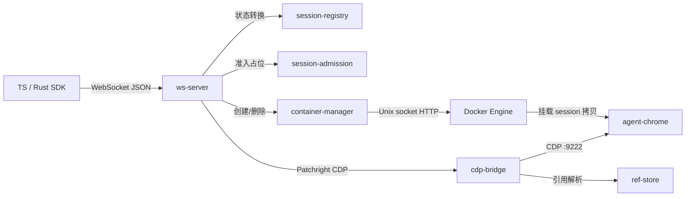
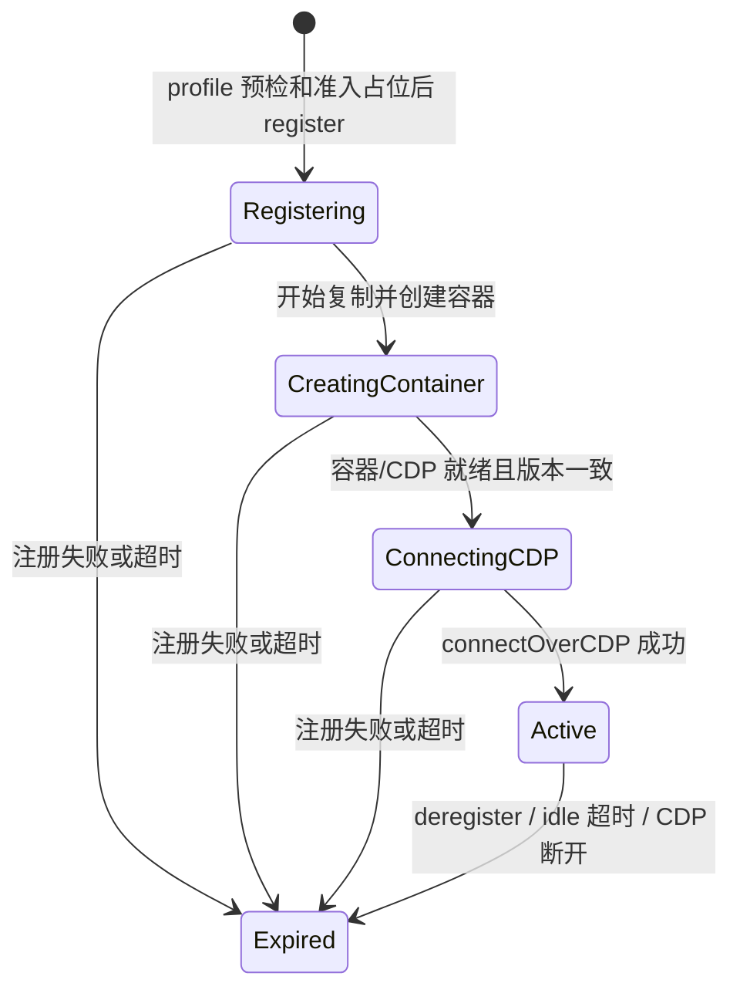

# Controller 设计

Controller 是 Node.js/TypeScript 服务端：接收 TS/Rust SDK 发来的 WebSocket JSON，验证 wire 请求，管理 session 与 agent-chrome 容器，通过 Patchright CDP 执行浏览器命令。本文描述仓库中的实现，不代表某一生产 tag 已部署；协议字段和错误变体以 `packages/types/src/index.ts`、容器与 session 行为以 `packages/controller/src/` 为准。

## 边界与模块

| 模块 | 职责与状态 |
|---|---|
| `index.ts` | 从环境变量取得配置，解析 controller owner 和 Patchright 浏览器版本锚，创建模块；启动前完成 owner 范围内的 reap、profile sweep 与共享准入 reconcile，失败则退出 78，不开放 WebSocket。 |
| `ws-server.ts` | arktype 验证 `WireRequest`，路由 register/command/deregister，映射具名 `ControllerError` 到 wire 错误；持有按 session ID 索引的 CDP 连接和清理操作。WebSocket 断开不会结束 session。 |
| `session-registry.ts` | 内存中的 `SessionState` 与 idle 扫描。记录只由当前 Controller 进程创建；重启后不恢复旧 session，而先回收本 owner 的 Docker 容器。 |
| `session-admission.ts` | 在共享状态目录以 slot 占位并结合 Docker 全 owner allocation 计算总额和 owner 限额。reservation 是资源生命周期中的占位，不是浏览器已可用的证明。 |
| `container-manager.ts` | 从受控 profile 来源复制整份 profile；经 Docker Engine API 创建、检查、停止、删除带 role/owner/session 标签的容器；在确认容器删除后删除拷贝。sessionId 到容器 ID 的内存映射仅是本进程的索引；缺失时按标签向 Docker 查找。 |
| `cdp-bridge.ts` / `ref-store.ts` | 持有 Patchright 浏览器上下文，执行 canonical `BrowserCommand`，维护 session 的页面、下载、网络与 `@eN` 引用状态；断开清理对应的运行时状态。 |

服务端是一个进程，不另设 Gateway 或注册服务。Node.js 用于 Patchright CDP 兼容性；`ws` 传输、arktype 边界解析、`node:http` + Docker Unix socket 管理容器，不使用 socket.io/dockerode。WebSocket 无应用层认证；session ID 是 bearer，网络边界必须限制对端访问（README §11.8）。

## 请求与 session 生命周期

`WireRequest` 只有 `register`（可带配置好的 profile 名）、`command`（sessionId + BrowserCommand）、`deregister`（sessionId）。正常响应分别为 `register_result`、`command_result`、`deregister_result`；不可解析或意外处理错误还可能返回 `type: "error"`。完整 command/result union 不在本文复制；修改协议须同步 `packages/types/src/index.ts`、`cli/sdk/src/wire.rs` 和调用方。每个 SDK 请求使用独立 WebSocket；没有 `resume` 帧、连接绑定 session 或断线重连状态机。命令按 session ID 查当前 Controller 的 registry；连接断开本身不改变 session。

`Expired` 是 registry 的逻辑终态，不等于磁盘/Docker 已清理。一次成功注册的顺序：`resolveProfilePath` 预检；`SessionAdmission.reserve` 在共享状态目录占额并分配 UUID；registry 进入 Registering；Controller `cp -a` 整份源 profile，清除副本顶层 `Singleton*` 并 `chown -R 1000:1000`；Docker 创建/启动 agent-chrome；轮询 `:9222/json/version` 并与 Patchright 锚比对；连接 CDP、进入 Active，才返回 session ID。容量或 profile 拒绝在容器创建前返回。注册中任何失败进入回滚路径，只有确认资源清理终态后才释放占额。

Active session 的每次命令更新 `lastActivity`；默认超过 `SESSION_IDLE_TIMEOUT=600000` ms，registry 每 30 秒扫描一次并触发清理。显式 deregister 在清理完成后返回成功；CDP `disconnected` 与 idle 扫描也触发清理。`ws-server` 以 session ID 合并同时到来的清理触发，先关闭 CDP（断连触发除外），再请 `container-manager.destroy` 停止/删除容器和移除拷贝，最后释放准入占额。`container-manager` 用 Docker 确认容器删除后才移除拷贝；Docker 删除失败则保留可能仍挂载的拷贝，返回失败。拷贝删除失败返回 `ProfileCleanupFailed`，不得把缺失的目录清理确认成成功或提前释放占额。deregister 响应受命令预算约束，预算耗尽表示结果未知；后台操作可能继续，不能凭响应超时推断资源已删除。CLI 只有收到成功响应才清本地槽位。

## Profile 来源、路径与回收

`default` 源由 `PROFILE_SOURCE` 指定（默认 `/data/profile`）；其他名字只从 `PROFILE_REGISTRY` 的 operator-owned JSON 中解析，须在 `PROFILE_STORE` 内，路径规范化后仍在可信根内。注册无法直接传文件路径或隐式创建命名源。`PROFILES_WORK` 是 Controller 内的工作目录（默认 `/data/profiles`），`PROFILES_HOST_PATH` 是 Docker bind mount 所需的同一宿主目录；二者必须映射到同一底层目录。每次复制目标为 `PROFILES_WORK/agent-<base64url(controllerOwner)>-<sessionId>`，agent-chrome 挂载对应宿主路径到 `/data/profile`。CDP 下载的工作目录是此副本内的 `.moat-downloads`，不是单独的 `agent-<sessionId>` 目录。

Controller owner 来自 `CONTROLLER_OWNER` 或自身容器的 Compose project 标签，启动时解析失败即退出。容器带 `moat-browser.role=agent-chrome`、`moat-browser.owner`、`moat-browser.session-id` 标签。Controller 启动时先列出并删除**本 owner** 的遗留容器；其副本仅在 Docker 确认删除后移除。随后遍历本 owner 的当前命名格式与 `agent-<uuid>` 旧格式目录，以**全 owner、全状态** agent-chrome 容器的 `/data/profile` mount 清单保护仍被使用的目录；Docker list/inspect 失败则不猜测、启动失败。只有确实不在 mount 清单中的这些候选才被删除；不扫描任意文件，也不删除其他 owner 的当前格式目录或容器。

跨 owner 的当前格式副本，即使没有 Docker mount，也可能正在 `cp -a` 与 Docker create 之间；本 Controller 不能据一次 mount 快照越权删除。若共享根中发现其他 owner 的孤儿目录，应由该 owner 确认自身生命周期并清理，不能把 `D−L` 简化为可安全删除的集合。当前格式同 owner 的启动 sweep 发生在该 owner 重启、旧进程不再创建副本之后。`agent-<uuid>` 旧格式按历史迁移处理；此规则依赖旧格式不再由当前代码生成。Docker Unix-socket 请求默认 10 秒 abort；删除返回“removal already in progress”时额外等待 Docker `condition=removed`，没有收到删除确认就保留拷贝并返回错误。

## 命令、错误与配置

`packages/types/src/index.ts` 定义完整 `BrowserCommand`/`CommandResultData`、`SessionState`、`ControllerError`、`WireResponse`、`ErrorCode` 与 arktype schema。请求 JSON 在 WebSocket 边界解析；`cdp-bridge.executeCommand` 按 action 执行 Patchright API，页面内容的 snapshot/eval/screenshot 带 `ContentBoundary`；`ref-store` 的引用仅在当前 session 的有效快照范围内使用。Controller 不从第三方返回值推断领域状态。

`ws-server.ts` 负责错误映射：profile 名不合法是 `invalid_value`；无 session/已过期是 `target_not_found`；Docker/复制/版本锚创建失败与清理失败带 `command_failed` 的对应 cause；`ProfileCleanupFailed` 明确为 `command_failed` + `cleanup`；容量拒绝保留 `capacity_exceeded` 的总额、owner 占额和重试条件；预算耗尽是 `timeout`，可能已有部分副作用。不要只凭 HTTP/WebSocket 连通或类型检查声称清理完成。

主要环境变量与缺省值见 README §9；`index.ts:loadConfig` 是实际解析入口。`PORT=3000`、`CDP_READY_TIMEOUT=30000`、`COMMAND_TIMEOUT=25000`、`SESSION_TOTAL_QUOTA=5`、`SESSION_IDLE_TIMEOUT=600000` 均可由环境覆盖；`SESSION_QUOTA` 和 `SESSION_OWNER_QUOTAS` 控制 owner 静态配额；`ADMISSION_STATE_PATH` 默认 `${PROFILES_WORK}/.moat-admission`，所有共享配额的 Controller 必须指向同一状态目录。配置错误、版本锚读取失败、启动清理或准入 reconcile 失败时进程退出 78，不继续接受新 session。
