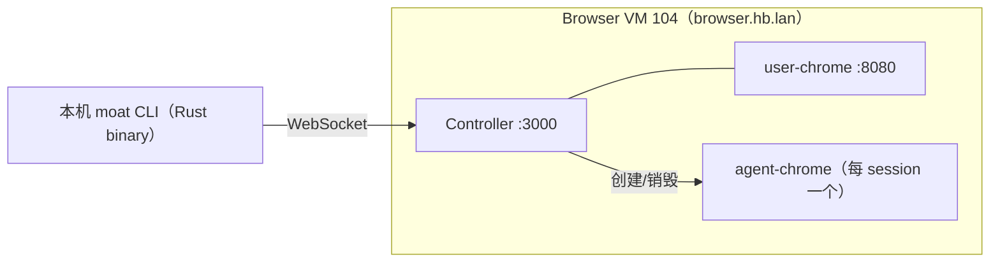

# E2E 测试方案：CLI 全功能验证

## 1. 目标

**第一阶段目标：收集问题，不修 bug。**

跑通 `moat` CLI 的所有命令路径，记录每个命令的实际行为：通过、失败、崩溃、输出格式不对。产出一份问题清单，作为后续修复的 backlog。

不做：性能测试、并发测试、错误恢复测试。

## 2. 测试环境



前置条件：
- 目标版本已由 `v*` tag 触发的 `.github/workflows/deploy.yml` 部署，Controller + user-chrome 在 Browser VM 上
- 本机有编译好的 `moat` 二进制：`cli/target/release/moat`
- 环境变量：`export MOAT_CONTROLLER="ws://browser.hb.lan:3000"`

## 3. 测试工具

测试脚本用 **shell**（不是 Rust/TS 测试框架），原因：
- 第一阶段是探测，不是自动化断言
- shell 直接调 `moat` 二进制，和 Agent 的使用方式一致
- 输出直接看，人工判断通过/失败
- 收集到的问题以注释记录在脚本里

每个测试用例：
```bash
echo "=== TEST: <name> ==="
moat <command> [args]
echo "exit: $?"
echo ""
```

## 4. 测试矩阵

### 4.1 Session 生命周期

| # | 命令 | 期望 | 备注 |
|---|------|------|------|
| S1 | `moat status` (无 session) | exit 77, "No active session" | |
| S2 | `moat connect` | exit 0, 打印 session ID | |
| S3 | `moat status` | exit 0, 显示 session ID + controller URL | |
| S4 | `moat disconnect` | exit 0, "Disconnected" | |
| S5 | `moat status` (已 disconnect) | exit 77 | |
| S6 | `moat connect --profile default` | exit 0, 带 profile 参数注册 | |

### 4.2 导航

前置：`moat connect` 已建立 session。

| # | 命令 | 期望输出 |
|---|------|---------|
| N1 | `moat open https://example.com` | 打印 title + URL |
| N2 | `moat open example.com` | 自动加 https://，打印 title + URL |
| N3 | `moat back` | 打印 title + URL |
| N4 | `moat forward` | 打印 title + URL |
| N5 | `moat reload` | 打印 title + URL |

### 4.3 语义定位器（主路径）

前置：`moat open https://example.com`

| # | 命令 | 期望 |
|---|------|------|
| L1 | `moat find role link --name "More information..."` | 定位到链接 |
| L2 | `moat find role heading --name "Example Domain"` | 定位到 h1 |
| L3 | `moat find text "Example Domain"` | 定位到文本 |
| L4 | `moat find role link click` | 点击链接 |

额外测试页面（需要有表单的页面）：

前置：`moat open https://the-internet.herokuapp.com/login`

| # | 命令 | 期望 |
|---|------|------|
| L5 | `moat find label "Username" fill "tomsmith"` | 填写 username |
| L6 | `moat find label "Password" fill "SuperSecretPassword!"` | 填写 password |
| L7 | `moat find role button --name "Login" click` | 点击登录 |
| L8 | `moat find text "You logged into a secure area!"` | 验证登录成功 |

### 4.4 Snapshot + @ref 操作

| # | 命令 | 期望 |
|---|------|------|
| R1 | `moat snapshot` | 输出 ARIA 树，含 @e1 @e2 等引用 |
| R2 | `moat click @e1` | 点击第一个可交互元素 |
| R3 | `moat hover @e1` | 悬浮 |

### 4.5 CSS selector 操作

前置：`moat open https://the-internet.herokuapp.com/login`

| # | 命令 | 期望 |
|---|------|------|
| C1 | `moat click "#login button"` | 点击按钮（CSS selector） |
| C2 | `moat fill "#username" "test"` | 填写输入框 |
| C3 | `moat type "#username" "test"` | 逐字输入 |
| C3a | `moat type "#username" "test" --clear --delay 100` | 先清空输入框，再以每字符 100ms 的延迟输入 |
| C4 | `moat hover "#login button"` | 悬浮 |

### 4.6 页面信息

| # | 命令 | 期望输出 |
|---|------|---------|
| P1 | `moat snapshot` | ARIA 树文本 |
| P2 | `moat snapshot --json` | JSON 格式 |
| P3 | `moat screenshot` | 文件路径或 base64 数据 |
| P4 | `moat screenshot --json` | JSON 格式 |
| P5 | `moat eval "document.title"` | 页面标题字符串 |
| P6 | `moat eval "1 + 1"` | "2" |
| P7 | `moat eval --json "document.title"` | JSON 包装 |

### 4.7 键盘和滚动

| # | 命令 | 期望 |
|---|------|------|
| K1 | `moat press Enter` | exit 0 |
| K2 | `moat press Tab` | exit 0 |
| K3 | `moat press "Control+a"` | exit 0 |
| K4 | `moat scroll down` | exit 0 |
| K5 | `moat scroll up 500` | exit 0 |

### 4.8 Tab 管理

| # | 命令 | 期望 |
|---|------|------|
| T1 | `moat tab list` | 显示 tab 列表，当前 tab 标记 → |
| T2 | `moat tab new https://example.org` | 新 tab，列表更新 |
| T3 | `moat tab list` | 2 个 tab |
| T4 | `moat tab switch 0` | 切回第一个 tab |
| T5 | `moat tab close 1` | 关闭第二个 tab |

### 4.9 Cookie

| # | 命令 | 期望 |
|---|------|------|
| CK1 | `moat cookies` | 显示 cookie 列表 |
| CK2 | `moat cookies --json` | JSON 格式 |
| CK3 | `moat cookies clear` | exit 0 |

### 4.10 Wait 命令

前置：`moat open https://the-internet.herokuapp.com/dynamic_loading/1`

| # | 命令 | 期望 |
|---|------|------|
| W1 | `moat wait 2000` | 等待 2 秒，exit 0 |
| W2 | `moat find role button --name "Start" click` 然后 `moat wait text "Hello World!"` | 等待文本出现 |
| W3 | `moat wait url "*/dynamic_loading*"` | 立即返回（URL 已匹配） |
| W4 | `moat wait load` | 等待页面加载完成 |

### 4.11 Get / Is 查询

前置：`moat open https://the-internet.herokuapp.com/login`

| # | 命令 | 期望输出 |
|---|------|---------|
| G1 | `moat get "#username" text` | 空字符串或 placeholder |
| G2 | `moat get "#username" value` | input 当前值 |
| G3 | `moat is "#username" visible` | "true" |
| G4 | `moat is "#username" enabled` | "true" |

### 4.12 Evaluate

| # | 命令 | 期望 |
|---|------|------|
| E1 | `moat eval "document.title"` | 页面标题 |
| E2 | `moat eval "JSON.stringify({a:1})"` | `{"a":1}` |
| E3 | `moat eval "window.location.href"` | 当前 URL |

### 4.13 Batch

| # | 命令 | 期望 |
|---|------|------|
| B1 | `echo '[["open","https://example.com"],["eval","document.title"]]' \| moat batch` | 两条命令依次执行 |

### 4.14 Close

| # | 命令 | 期望 |
|---|------|------|
| X1 | `moat close` | session 销毁，等价 disconnect |
| X2 | `moat status` | exit 77 |

### 4.15 P1 元素操作

前置：`moat open https://the-internet.herokuapp.com/checkboxes`

| # | 命令 | 期望 |
|---|------|------|
| P1a | `moat check "input[type=checkbox]:first-child"` | 勾选 |
| P1b | `moat uncheck "input[type=checkbox]:first-child"` | 取消 |
| P1c | `moat is "input[type=checkbox]:first-child" checked` | "false" |

前置：`moat open https://the-internet.herokuapp.com/dropdown`

| P1d | `moat select "#dropdown" "Option 1"` | 选择下拉 |

前置：`moat open https://the-internet.herokuapp.com/key_presses`

| P1e | `moat focus "#target"` | 聚焦 |
| P1f | `moat keyboard type "hello"` | 输入文本 |
| P1g | `moat press "a"` → `moat get "#result" text` | 显示按键结果 |

### 4.16 --json 模式全局验证

对以上每个分类抽一个命令加 `--json`，验证：
- 输出是合法 JSON
- 有 `success` 字段
- 成功时有 `data`，失败时有 `error`

### 4.17 Exit Code 验证

| 场景 | 期望 exit code |
|------|---------------|
| 命令成功 | 0 |
| 无 session | 77 |
| 配置错误（无 MOAT_CONTROLLER） | 78 |
| 未知命令 | 1 |
| 元素未找到 | 1 (Controller 返回 error) |

## 5. 测试脚本结构

```
packages/e2e/
├── e2e.test.ts              # 现有 TS WebSocket 级测试（保留）
├── cli-e2e.sh               # 新增：CLI 级 E2E 测试脚本
└── cli-e2e-results.md       # 新增：测试结果记录
```

`cli-e2e.sh` 结构：

```bash
#!/bin/bash
set -euo pipefail

MOAT="${MOAT:-./cli/target/release/moat}"
export MOAT_CONTROLLER="${MOAT_CONTROLLER:-ws://browser.hb.lan:3000}"

PASS=0
FAIL=0
ISSUES=()

run_test() {
  local name="$1"
  shift
  echo "=== TEST: $name ==="
  set +e
  output=$("$MOAT" "$@" 2>&1)
  code=$?
  set -e
  echo "$output"
  echo "exit: $code"
  echo ""
}

# ... test cases ...

# Summary
echo "=== RESULTS ==="
echo "Pass: $PASS"
echo "Fail: $FAIL"
for issue in "${ISSUES[@]}"; do
  echo "  - $issue"
done
```

## 6. 已知预期会失败的测试

根据设计文档 review 的结论：

| 测试 | 预期失败原因 |
|------|------------|
| P3 screenshot | Controller 返回 base64，CLI 期望 `data.path` — SDK 未做文件写入转换 |
| L1-L4 语义定位器输出 | Controller 返回 `LocatorResult { found, count }`，CLI 期望 `{ ref, role, name }` |
| B1 batch (stdin 模式) | CLI 的 batch 从 stdin 读取后逐条调 `send_command`，但 `send_command` 每次重建连接 |
| C1-C4 CSS selector | CLI 的 `click "selector"` 构造 `{ action: "click", selector: "..." }`，但 upstream commands.rs 不知道 moat 的 selector 模式，可能只生成 `{ action: "click", ref: "selector" }` |
| P1a-P1g P1 操作 | CLI parse_command 生成的 action 名/字段名可能与 Controller 期望不一致 |
| dialog/frame/console/errors | Controller 侧是 stub 实现 |

## 7. 问题记录格式

`cli-e2e-results.md`：

```markdown
| # | 测试 | 状态 | 问题描述 | 分类 |
|---|------|------|---------|------|
| S1 | status (no session) | PASS | — | — |
| P3 | screenshot | FAIL | 输出 base64 而非文件路径 | SDK 翻译缺失 |
| L1 | find role link | FAIL | 输出空白而非 ref 信息 | 响应格式不匹配 |
```

分类：
- **通过** — 行为符合预期
- **响应格式不匹配** — Controller 返回格式与 CLI output.rs 期望不一致
- **命令格式不匹配** — CLI parse_command 生成的 JSON 与 Controller 期望不一致
- **SDK 翻译缺失** — SDK 应该做但没做的转换（如 screenshot 文件写入）
- **未实现** — Controller stub / 不支持的功能
- **崩溃** — CLI panic 或 Controller 崩溃
- **连接问题** — WebSocket 连接/超时/断开

## 8. 执行步骤

1. 确认 Controller 运行中：`km ps -s Browser`
2. 编写 `cli-e2e.sh` 测试脚本
3. 执行：`bash packages/e2e/cli-e2e.sh 2>&1 | tee packages/e2e/cli-e2e-results.log`
4. 人工 review 输出，填写 `cli-e2e-results.md`
5. 从结果中提取 issue 列表
