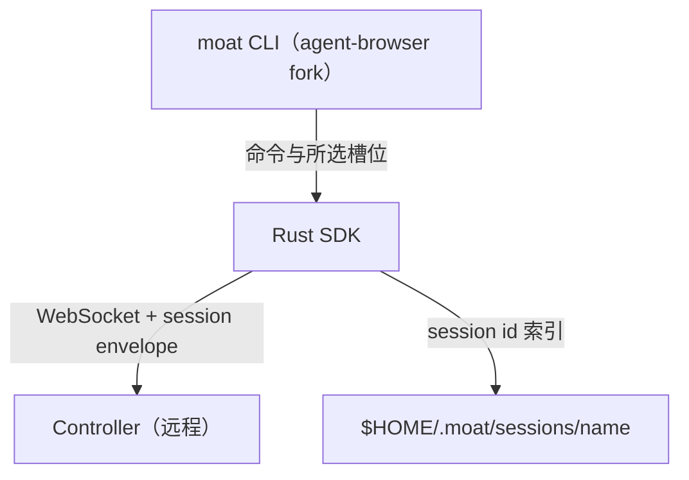
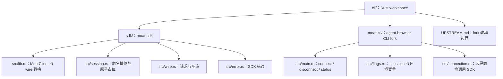

# Rust SDK 设计文档

## 1. 定位

Rust SDK 是 moat CLI 与 Controller 之间的 **transport 适配层**。

agent-browser CLI 原本通过 Unix socket 连本地 daemon；moat 的 CLI fork 通过 Rust SDK 的 WebSocket 请求远程 Controller。命令词汇尽量与 upstream 一致；CLI 另有 `connect`、`disconnect`、`status` 和命名 session 槽位，SDK 保存本地句柄并转换 wire envelope。fork 的实际改动边界见 `cli/UPSTREAM.md`。



## 2. 协议差异分析

### 2.1 agent-browser daemon 协议

```
传输: Unix socket / TCP localhost
格式: 行分隔 JSON (\n 结尾)

请求: { "id": "r123", "action": "navigate", "url": "..." }
响应: { "success": true, "data": {...}, "error": null, "warning": null }
```

- 无显式 session 管理（一个 daemon = 一个浏览器实例）
- `id` 字段用于标识请求
- `action` + `serde(flatten)` 额外字段
- 响应扁平结构：`success` + `data` + `error` + `warning`

### 2.2 moat Controller 协议

```
传输: WebSocket
格式: JSON WebSocket frame

请求: { "type": "command", "sessionId": "abc", "command": { "action": "navigate", "url": "..." } }
响应: { "type": "command_result", "sessionId": "abc", "success": true, "data": { "_tag": "NavigateResult", ... } }
```

- 显式 session 管理（register / deregister）
- 命令包在 session envelope 里
- 响应的 `data` 带 `_tag` discriminant

### 2.3 SDK 的翻译职责

| agent-browser 侧 | SDK 翻译 | Controller 侧 |
|---|---|---|
| 无 session 概念 | `connect()` → | `{ type: "register" }` |
| `{ id, action, ...fields }` | 剥 `id`，包 envelope → | `{ type: "command", sessionId, command: { action, ...fields } }` |
| 期望 `{ success, data, error }` | ← 解包 envelope | `{ type: "command_result", sessionId, success, data: { _tag, ... } }` |
| 无 | `disconnect()` → | `{ type: "deregister", sessionId }` |

## 3. 命令兼容性 Gap 分析

### 3.1 已对齐的命令（Controller 已实现）

moat Controller 的 BrowserCommand 已覆盖 agent-browser CLI 最核心的命令集：

| 分类 | action | 备注 |
|---|---|---|
| 导航 | `navigate`, `back`, `forward`, `reload` | 完全对齐 |
| 语义定位 | `getbyrole`, `getbylabel`, `getbyplaceholder`, `getbytext`, `getbyalttext`, `getbytitle`, `getbytestid` | 完全对齐，这是 90% 的交互路径 |
| @ref 操作 | `click`(ref), `fill`(ref), `type`(ref), `hover`(ref) | 完全对齐 |
| 页面信息 | `snapshot`, `screenshot`, `eval`/`evaluate` | action 名差异：upstream 叫 `evaluate`，moat 叫 `eval` |
| 键盘 | `press` | 完全对齐 |
| 滚动 | `scroll` | 完全对齐 |
| Tab | `tab_new`, `tab_switch`, `tab_close`, `tab_list` | 完全对齐 |
| Cookie | `cookies_get`, `cookies_clear` | 完全对齐 |
| 等待 | `wait` | 部分对齐（见下方 Gap） |

### 3.2 存在 Gap 的命令

agent-browser 有但 moat Controller **未实现**的 action：

| action | agent-browser 用途 | 优先级 | 处理策略 |
|---|---|---|---|
| `click`(selector) | CSS 选择器点击（非 @ref） | **高** | Controller 需新增：selector 模式的 click/fill/type/hover 等 |
| `dblclick` | 双击 | 中 | Controller 新增 |
| `fill`(selector) | CSS 选择器填充 | **高** | 同上 |
| `type`(selector) | CSS 选择器输入 | **高** | 同上 |
| `hover`(selector) | CSS 选择器悬浮 | 中 | 同上 |
| `focus` | 聚焦元素 | 低 | Controller 新增 |
| `check`/`uncheck`(selector) | CSS 选择器勾选 | 中 | Controller 新增 |
| `select` | 下拉选择 | 中 | Controller 新增 |
| `drag` | 拖拽 | 低 | Controller 新增 |
| `upload` | 文件上传 | 中 | Controller 新增 |
| `download` | 文件下载 | 低 | Controller 新增 |
| `evaluate` | JS 执行 | **高** | **action 名映射**：SDK 层 `evaluate` → `eval` |
| `wait`(selector) | 等待元素出现 | **高** | Controller 需扩展 wait 命令 |
| `waitforurl` | 等待 URL 变化 | 高 | Controller 新增 |
| `waitforloadstate` | 等待页面加载 | 高 | Controller 新增 |
| `waitforfunction` | 等待 JS 条件 | 中 | Controller 新增 |
| `waitfortext` | 等待文本出现 | 高 | Controller 新增 |
| `waitfordownload` | 等待下载完成 | 低 | Controller 新增 |
| `keyboard`(type/insertText) | 键盘输入 | 中 | Controller 新增 |
| `keydown`/`keyup` | 按键按下/释放 | 低 | Controller 新增 |
| `scrollintoview` | 滚动到元素 | 中 | Controller 新增 |
| `nth` | 第 N 个元素 | 中 | Controller 新增 |
| `batch` | 批量执行 | **高** | Controller 新增或 SDK 层循环发送 |
| `get` | 获取元素属性 | **高** | Controller 新增 |
| `is` | 检查元素状态 | **高** | Controller 新增 |
| `pdf` | 生成 PDF | 低 | Controller 新增 |
| `inspect` | 检查页面 | 低 | Controller 新增 |
| `close` | 关闭 daemon | **高** | SDK 映射为 `deregister` |
| `cookies_set` | 设置 cookie | 中 | Controller 新增 |
| `auth_*` | 凭据管理 | 低 | 不实现（moat 用 profile 机制替代） |
| `confirm`/`deny` | 操作确认 | 低 | 不实现（moat 无 action policy 层） |
| `launch` | 连接到 CDP | 低 | 不实现（moat 由 Controller 管理） |
| `stream_*` | 屏幕录制流 | 低 | 不实现（moat 有 neko WebRTC） |
| `console`/`errors` | 控制台日志 | 中 | Controller 新增 |
| `highlight` | 高亮元素 | 低 | Controller 新增 |
| `clipboard_*` | 剪贴板 | 低 | Controller 新增 |
| `state_save/load` | 状态存取 | 低 | 不实现 |
| `dialog` | 弹窗处理 | 中 | Controller 新增 |
| `trace_*`/`profiler_*` | 性能分析 | 低 | 不实现 |
| `recording_*` | 录屏 | 低 | 不实现 |
| `frame`/`mainframe` | iframe 切换 | 中 | Controller 新增 |
| `window_new` | 新窗口 | 低 | Controller 新增 |
| `mouse` | 鼠标操作 | 低 | Controller 新增 |
| `set` | 浏览器设置 | 低 | 不实现 |

### 3.3 优先级判断

**P0（必须，Agent 日常用）**：

agent-browser 的核心交互模式有两条路径：
1. **语义定位器** (`find role/label/text/...`) → `getbyrole` 等 — **已实现**
2. **CSS 选择器** (`click @e3`, `click .btn`) → `click`(selector), `fill`(selector) 等

当前 moat Controller 的 `click`/`fill`/`type`/`hover` 只接受 `ref` 字段（@eN 引用）。agent-browser 的 `click`/`fill`/`type`/`hover` 还支持 CSS 选择器（`selector` 字段）。**这是最大的 gap。**

此外：
- `evaluate` → `eval` 名称映射
- `close` → `deregister` 映射
- `wait`(selector) / `waitforurl` / `waitfortext` — Agent 等待页面变化的核心能力
- `get` / `is` — 查询元素属性/状态
- `batch` — 批量执行（Agent 常用）

**P1（重要，完整性）**：
- `dblclick`, `check`/`uncheck`, `select`, `keyboard`, `scrollintoview`
- `upload`, `cookies_set`, `dialog`, `frame`/`mainframe`
- `console`/`errors`, `nth`

**P2（低优，暂不实现）**：
- `auth_*`（moat 用 profile 替代）
- `confirm/deny`（无 action policy）
- `launch`（Controller 管理 CDP）
- `stream_*`（有 neko）
- `trace_*`/`profiler_*`/`recording_*`
- `state_save/load`, `set`, `highlight`, `clipboard`
- `drag`, `download`, `pdf`, `inspect`, `mouse`, `window_new`

## 4. 需要调整的内容

### 4.1 Controller 侧变更

**Phase A：支持 selector 模式的元素操作**

当前 cdp-bridge.ts 的 `click`/`fill`/`type`/`hover` 只处理 `ref` 字段。需要扩展为：
- 有 `ref` 字段 → 走 refStore 查找 Locator（现有逻辑）
- 有 `selector` 字段 → 走 `page.locator(selector)` CSS 定位

types 变更：
```typescript
// 当前
| { readonly action: "click"; readonly ref: string }

// 扩展为
| { readonly action: "click"; readonly ref?: string; readonly selector?: string; readonly newTab?: boolean }
| { readonly action: "fill"; readonly ref?: string; readonly selector?: string; readonly value: string }
| { readonly action: "type"; readonly ref?: string; readonly selector?: string; readonly text: string; readonly clear?: boolean; readonly delay?: number }
| { readonly action: "hover"; readonly ref?: string; readonly selector?: string }
```

**Phase B：新增 P0 命令**

| 新 action | Patchright 实现 |
|---|---|
| `evaluate` | 别名，等价 `eval`（或 Controller 接受两者） |
| `wait`(selector) | `page.locator(selector).waitFor()` |
| `waitforurl` | `page.waitForURL(pattern)` |
| `waitforloadstate` | `page.waitForLoadState(state)` |
| `waitforfunction` | `page.waitForFunction(expr)` |
| `waitfortext` | `page.getByText(text).waitFor()` |
| `get` | `locator.getAttribute(prop)` / `.textContent()` / `.innerText()` 等 |
| `is` | `locator.isVisible()` / `.isEnabled()` / `.isChecked()` 等 |
| `batch` | 循环执行命令数组 |
| `close` | 等价 `deregister`（Controller 端接受 `{ type: "command", command: { action: "close" } }` 并触发 deregister） |

**Phase C：新增 P1 命令**

`dblclick`, `check`, `uncheck`, `select`, `focus`, `keyboard`, `keydown`, `keyup`, `scrollintoview`, `nth`, `upload`, `cookies_set`, `dialog`, `frame`, `mainframe`, `console`, `errors`

### 4.2 Rust SDK 的翻译层

SDK 管理每次调用的 WebSocket、wire envelope 与本地 session 索引。CLI 以 `--session` > `AGENT_BROWSER_SESSION` > `default` 选择槽位；名字限定为 1–255 个 ASCII 字母、数字、`_` 或 `-`。`init` 在发出 Register 前通过排他创建占位文件原子认领 `$HOME/.moat/sessions/<name>`；同名的第二个 `init` 在注册前失败。注册失败移除占位，成功后写入返回的 id。旧 `$HOME/.moat/session` 不读取；Controller 的 session 生命周期不由本地索引决定。

```rust
impl MoatClient {
    pub async fn init(url: &str, profile: Option<&str>, slot: &str) -> Result<Self, SdkError>;
    pub fn from_session(url: String, session_id: String, slot: &str) -> Result<Self, SdkError>;
    pub async fn command(&self, request: Value) -> Result<Response, SdkError>;
    pub async fn destroy(&self) -> Result<(), SdkError>;
}
```

每条远端请求新建一个 WebSocket。`command` 去掉 daemon 请求的 `id`，包在所选 Controller session 的 envelope 中，再把响应转回 CLI 的结果形状；`destroy` 仅在 Controller 确认清理后删除所选槽位。`status` 只读本地句柄与 Controller 地址，不探测远端健康。不同名字的槽位互不干扰。

**名称映射**（SDK 层做）：
- 输入 `action: "evaluate"` → 发送 `action: "eval"`
- 输入 `action: "close"` → 发送 `{ type: "deregister", sessionId }`

**响应转换**（SDK 层做）：
```
Controller: { type: "command_result", sessionId, success: true, data: { _tag: "NavigateResult", url, title } }
                                                                  ↓ SDK 解包
CLI 收到:   { success: true, data: { url, title } }
```
- 去掉 `type`, `sessionId` envelope
- 去掉 `data._tag`（CLI 不需要 discriminant）

## 5. Rust SDK crate 结构



## 6. 实施顺序

| 步骤 | 内容 | 说明 |
|---|---|---|
| 1 | Controller: 扩展 click/fill/type/hover 支持 selector | 解除最大 gap |
| 2 | Controller: 新增 P0 命令 (evaluate alias, wait variants, get, is, batch, close) | 覆盖 Agent 日常用例 |
| 3 | Rust SDK crate: wire types + WebSocket + session 管理 | transport 层 |
| 4 | CLI fork: connection.rs 改为调用 SDK, 加 connect/disconnect/status | 接入 |
| 5 | Controller: 新增 P1 命令 | 完善 |
| 6 | E2E: Rust CLI 端到端测试 | 验证 |

## 7. 不做的事

- **不在 SDK 层做命令翻译/重写** — SDK 只做 transport envelope，命令内容透传（除 evaluate→eval 和 close→deregister 两个映射）
- **不实现 P2 命令** — auth_*、stream_*、trace_* 等与 moat 架构不相关
- **不改 CLI 的命令解析** — commands.rs 保持 upstream 同步
- **不做 action policy / confirmation 流程** — moat 的安全边界在 Controller 层，不在 CLI
